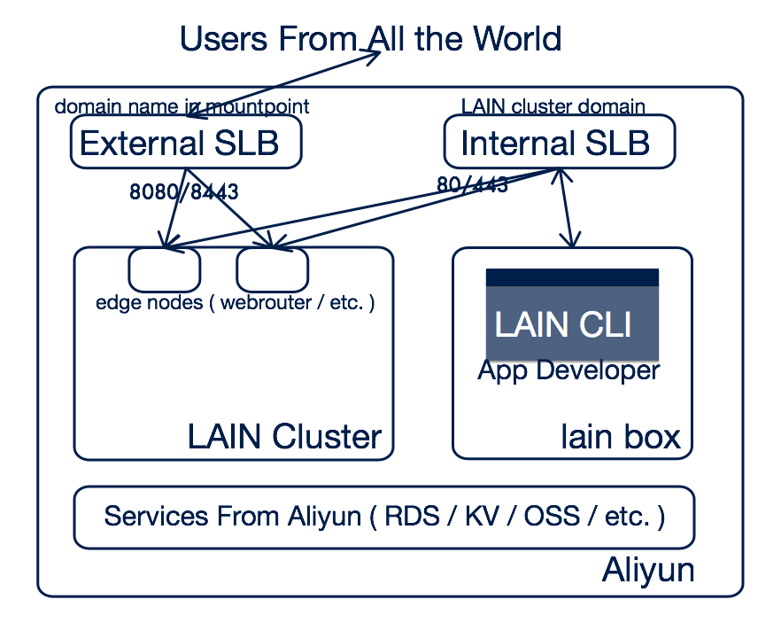
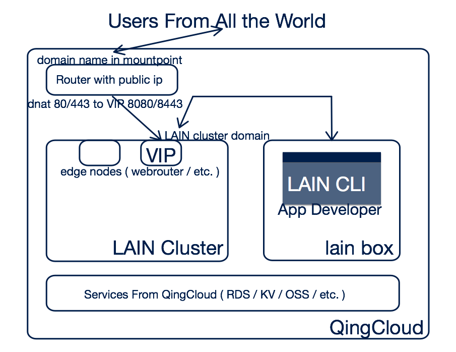

# Production Install

## Prerequirements

Lain 理论上可以运行在任何 Linux 发行版之上，只需要满足如下条件：

1. 使用 systemd
1. Linux 内核版本 >= 3.10 （for [Docker](https://www.docker.com/))
1. 有 curl 命令行可用

例如 CentOS 7 即满足以上条件。

*注：因为时间的原因暂时只在 centos 7.1+ 上进行了测试，建议使用 centos 7.1 以上版本*

### 公有云支持

>未列举不代表不支持，只是还没有验证

- [aliyun](aliyun.html)
- [qingcloud](qingcloud.html)
- [aws](aws.html)

## 生产环境的规划和配置

>大家既然看到这一章就是为了在生产环境中使用 LAIN
>那必然需要考虑到方方面面的事情
>下面就以 aliyun 为例讲述一下如何进行 LAIN 的生产环境配置
>并给出一个具有一定可用性/安全性/可行性的生产集群规划方案

### 1 规划 LAIN 集群的网络拓扑以及域名设定

>建议先阅读 [Domains And SSL](../domainandssl.html) 一章了解 LAIN 集群里的几种类型的域名以及配置方法

*以 Aliyun 部署为例*

#### 1.1 举例：一种对可用性，安全性有所考虑的网络拓扑设计




#### 1.2 补充：上述网络拓扑设计的预设以及详细解说

*预设*

- 一个 startup 公司，假设叫做 PowerLain 公司
- 他们打算用 Aliyun 搭建 LAIN 集群来部署自己的互联网服务

*可用性考量*

- 最前端采用 SLB
- LAIN web 入口 HA
- LAIN master HA
- etc.

*安全考量*

- 为了安全因素考量，对用户服务的域名会单独购买，不使用 LAIN cluster domain 的子域名，也就是说:
    - LAIN cluster domain 生成的默认应用域名，希望只在公司内网（或者更干脆的只在 Aliyun 内网能访问）
    - 对用户服务的域名，都单独购买域名和 SSL 证书，通过 web Proc 的 mountpoint 功能和 LAIN 集群的 ssl 设置来响应外部服务
- 利用 LAIN 集群的 webrouter 组件的内建机制，物理分隔用户服务的外网域名和内网服务的内网域名之间的入口，避免暴露内部服务到外网
    - webrouter 内建机制，对 mountpoint 中指定的外网域名（判断标准是不在 `lain` `lain.local` 以及 `etcdctl get /lain/config/extra_domains` 结果列表内），建立 nginx 配置时额外响应 8080/8443 端口组，而内网域名只响应 80/443 端口组
    - Aliyun 建立外网 SLB
        - 配置 DNS 解析，对 mountpoint 中指定的外网域名解析到外网 SLB 公网 ip
        - dnat 外网访问外网 SLB 公网 ip 80/443 的流量到 webrouter node 的 8080/8443 端口，webrouter node 可按照 webrouter scale 的攻略横向扩展
    - Aliyun 建立内网 SLB
        - 配置 DNS 解析，对 LAIN 集群标准域名的统配域名解析到内网 SLB 入口 ip
        - dnat 外网访问内网 SLB 入口 ip 80/443 的流量到 webrouter node 的 80/443 端口，webrouter node 可按照 webrouter scale 的攻略横向扩展
        - *注意：Aliyun 中 SLB 的后端 server 不能反向访问 SLB，因此 LAIN 集群内部需要劫持集群标准域名到某个 webrouter 存在的节点 IP*
- 在 Aliyun LAIN 集群的同一个 VPC 建立一个 lain-box 节点，安装好 LAIN CLI，用来进行 LAIN 集群上应用的管理

### 2 为 Docker 配置 devicemapper direct-lvm

关于 devicemapper 的详细内容可参考 docker [官方文档](https://docs.docker.com/engine/userguide/storagedriver/device-mapper-driver/)。

默认情况下，docker 底层使用的 devicemapper 以 loop-lvm 模式启动，这是官方**强烈不推荐**在生产环境使用的。所以，建议每个 lain-node 都为 docker 准备一个 100G+ 空间大小的磁盘，以供为 devicemapper 配置 direct-lvm 使用。

*以 Aliyun 为例*

1. 为服务器实例创建新磁盘，建议 100G 以上。
2. bootstrap 时候设置 `--docker-device` 参数。
   假设我们添加的新磁盘设备为 `/dev/vdb`，则 bootstrap 命令为：
   ```bash
   ./bootstrap -r docker.io/laincloud --docker-device=/dev/vdb --ipip
   ```
3. bootstrap 成功后，`docker info` 查看配置。如果不是 `direct-lvm` 信息中会有类似下面的WARNING:
   ```sh
   WARNING: Usage of loopback devices is strongly discouraged for production use. Either use `--storage-opt dm.thinpooldev` or use `--storage-opt dm.no_warn_on_loop_devices=true` to suppress this warning.
    ```

增加节点同理，指定 `--docker-device` 参数，新节点的 docker 就会使用 direct-lvm。如：
```bash
lainctl node add -p playbooks --docker-device=/dev/vdb node2:192.168.77.22
```

## 沙盘演练

*依然延续上面的 Aliyun 的例子，拓扑图和预设*

- Preconditions:
    - PowerLain 公司打算做一个公司首页，域名和 SSL 证书都已买好
        - powerlain.com
        - powerlain.com.key && powerlain.com.crt
    - PowerLain 公司已有 Aliyun 账户
        - 先创建了一个 VPC ，配套的网络和路由器也创建好，选定网段是 192.168.77.0/24
        - 创建一个安全策略，为了避免麻烦粗放的定为放行所有流量（仅为方便，实际生产中应该尽可能多做隔离）
        - 先弄一个 LAIN 节点的模板镜像
            - 在上述 VPC 里创建一个 ECS ，使用 centos 7 模板，按需收费，根分区 20 G （各项都仅供参考）
            - yum update
            - yum install -y epel-release
            - 等都 OK 之后保存为一个自定义的模板镜像，姑且命名为 lain-node-tmpl
        - 创建一个外网 SLB （负载均衡），假设其公网 ip 为 ex-SLB-ip
        - 创建一个内网 SLB （负载均衡），假设其入口 ip 为 in-SLB-ip
    - PowerLain 公司打算在 VPC 里面搭建 LAIN 生产集群
        - 直接使用 LAIN 的默认的集群标准域名 `lain.local` 进行集群控制和应用部署，采用内部 DNS 劫持或者直接写 `/etc/hosts` 的方案进行解析
        - 在 LAIN 集群所在的 VPC 另外创建一个管理跳板机，上面部署 openvpn ，以此让办公网可以通过 vpn 连接生产网络

- Steps:
    - 搭建 LAIN 集群
        - VPC 里使用 lain-node-tmpl 模板创建 ECS node：lain-01 ，资源需要 2U4G 以上，`/` 分区 20G，另有 100G 磁盘（设备名可在磁盘详情页看到，假设为 `/dev/vdb`）。
            - 相对更有可用性的配置是 `/` 分区 20G ， `/data` 分区 100G 放置一些可能落地的数据和日志 ， 另再有 100G 的磁盘提供给 docker 的 direct-lvm devicemapper storage
            - 实际的磁盘大小看需求调整
            - 如果要开启 moosefs 选项的话会有更多需要自主配置的内容
        - `@lain-01` 改好 hostname 等 `hostname -s lain-01` 之后 relogin
        - 假设 lain-01 的 node ip 是 192.168.77.21
        - `@lain-01` `cd lain` 然后 `./bootstrap -r docker.io/laincloud --ipip --docker-device /dev/vdb`
        - 同样的配置创建 lain-02 lain-03 ，并加入集群，假设他们的 ip 是 192.168.77.22 192.168.77.23
            - `@lain-01`: lainctl node add -p playbooks --docker-device /dev/vdb lain-02:192.168.77.22
            - `@lain-01`: lainctl node add -p playbooks --docker-device /dev/vdb lain-03:192.168.77.23
    - 可选：按照 [域名和 SSL 配置文档](../domainandssl.html) 给 `powerlain.com` 这个域名配置上 `powerlain.com.key && powerlain.com.crt` 这一组 SSL 证书
    - 搭建 管理跳板机 lain-baseton
        - 使用 lain-node-tmpl 模板在 VPC 里创建跳板机
            - 参考 [lain-box 的构建方式](https://github.com/laincloud/lain-box/tree/master/builder) 安装各种依赖等
            - `@lain-baseton` 执行 `lain config save local domain lain.local` 和 `lain config save-global private_docker_registry registry.lain.local`
    - 设定内网 SLB
        - 将 webrouter 所在的节点作为其后端，in-SLB-ip 的 80/443 端口对应 webrouter 所在节点的 80/443 端口
        - 内网设定 `*.lain.local` 的 DNS 劫持到 in-SLB-ip （*注意：Aliyun 中 SLB 的后端 server 不能反向访问 SLB，因此 LAIN 集群内部需要劫持 lain.local 到某个 webrouter 存在的节点 IP*）
    - 可选：在 `lain-baseton` 上 [webrouter scale](../maintain/webrouter.html)
        - 将新增的 webrouter 所在节点加入到内网 SLB 后端中
    - 设定公网 SLB
        - 将 webrouter 所在的几个节点作为其后端，ex-SLB-ip 的 80/443 端口对应 webrouter 所在节点的 8080/8443 端口
        - 设定 powerlain.com 的 DNS 解析到 ex-SLB-ip
    - 可选：打开 LAIN 集群的 auth 机制，参见 [auth](../auth.html) 和 [sso](../sso.html)
        - 打开 LAIN 集群的 auth 机制之后 lain-baseton 上进行操作时也需要进行 lain login 等操作
    - 在 `lain-baseton` 上进行 powerlain.com 网站的开发，通过 LAIN CLI 部署到 LAIN 集群
        - `lain.yaml` 的内容 DEMO
            ```
            appname: powerlain
            build:
                base: incloud/centos-lain:20160503  # 这个 base image 里包含了 golang/python/nodejs 环境
                script:
                    - go build -o powerlain
            web:
                port: 8000
                memory: 256m
                num_instances: 1
                cmd: /lain/app/entry.sh
                env:
                    - COPYRIGHTYEAR=2016
                mountpoint:
                    - powerlain.com
            ```
        - 具体的构建和发布过程请参考
            - [app-demo](../../quickstart/app-demo.html)
            - [IntoTheLAINStepbyStep](../../quickstart/stepbystep.html)
            - [LAIN Tour](../../usermanual/tour.html)
            - [SDK && CLI](../../usermanual/sdkandcli.html)
        - `lain ps local` 即可查看部署结果
        - 此时应可通过 `powerlain.lain.local` (前提是进行了 DNS 劫持，或者写了 `/etc/hosts`) 或者 `powerlain.com` 对部署好的网站进行访问
    - 可选：本地安装 `lain-box` ，并通过自己在 `lain-baseton` 上搭建 `openvpn` 的方式连入到 VPC 内网，处理好 DNS 解析之后即可在本地进行 LAIN 的应用开发管理

## 增补： QingCloud 上进行 LAIN 生产集群安装规划的不同点

*QingCloud 和 Aliyun 上推荐的 LAIN 生产集群安装的不同点*

### 1 网络拓扑图



与 Aliyun 的部分不一样的地方：

*可用性考量*

- 最前端使用 QingCloud 提供的路由器
- LAIN web 入口 HA 使用 LAIN 集群提供的 vip 模式实现
- LAIN master HA
- etc.

*安全考量*

- 利用 LAIN 集群的 webrouter 组件的内建机制，物理分隔用户服务的外网域名和内网服务的内网域名之间的入口，避免暴露内部服务到外网
    - webrouter 内建机制，对 mountpoint 中指定的外网域名（判断标准是不在 `lain` `lain.local` 以及 `etcdctl get /lain/config/extra_domains` 结果列表内），建立 nginx 配置时额外响应 8080/8443 端口组，而内网域名只响应 80/443 端口组
    - QingCloud 路由器和防火墙设定
        - 配置 DNS 解析，对 mountpoint 中指定的外网域名解析到路由器公网 ip
        - 配置路由器 dnat 外网访问公网 ip 80/443 的流量到 webrouter vip 的 8080/8443 端口，webrouter node 可按照 webrouter scale 的攻略横向扩展
        - 配置防火墙允许 80/443 的 TCP 入流量
    - 利用 QingCloud 提供的 openvpn 直接使用 vip 作为内网入口
        - 配置 DNS 解析，对 LAIN 集群标准域名的统配域名解析到 LAIN vip
- 在 lain-node-tmpl 建立一个 lain-box 节点，安装好 LAIN CLI，用来进行 LAIN 集群上应用的管理
    - 或者本地直接建立 lain-box ，连上 openvpn 后可直接配置和使用 LAIN CLI
