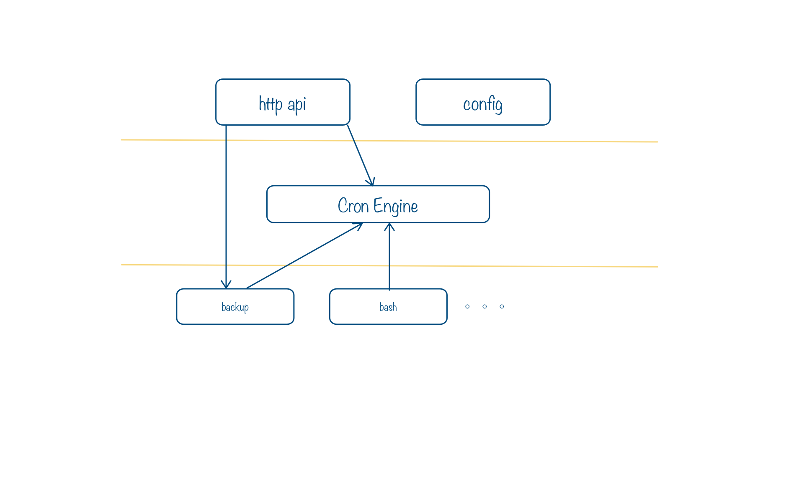

volume backup service for lain
# backupd

## 介绍

Backupd主要是为Lain集群上的app提供备份功能。使用者可在lain.yaml中配置volume的备份属性，对volume进行定时备份。

## 整体设计

backupd以一个定时的角度器为核心，即`cron-engine`。该模块具有定时调度的功能，并会把调度的结果post给指定的地址。engine所支持的任务类型，以插件的形式注册到engine上。

对volume的备份功就属于`cron-engine`的一个插件，我们通过api，把定时任务提交给`cron-engine`, engine就会根据设定在指定时间执行某插件。



设计主要分3层。API层，调度层和任务层

### API层

主要处理http请求，通过调用以下两层的接口函数，来处理相应的请求。

### 调度层

实现类似于linux cron服务的调度功能，该层只有一个crond模块, 该模块提供Register函数来获取新功能，通过Update函数来更新任务列表。

### 任务层

实现各种用于crond调度的任务功能模块。包括备份任务, Test任务(demo)。

任务层的backup功能，使用driver形式开发，已支持不通的备份后端存储。目前只支持moosefs driver.

如果需要其他的如七牛或HDFS等，需要已同样的方式开发driver。这样主要是为了方便扩展。


## 编译和运行

### 编译

**需要环境: go1.5+**
```sh
go build -o backupd
```

### 运行

**需要环境: lainlet, moosefs**

创建配置文件, 可参考Demo配置文件`./config/default.yaml`
```sh
# 例子
./backupd -f ./config/default.yaml
```
