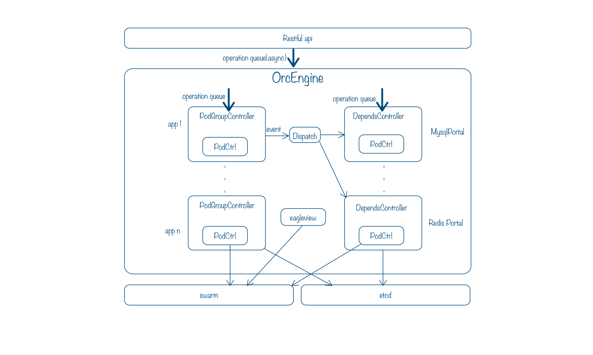

# Lain Deloyd

## 基本介绍

Deployd是负责Lain中底层容器编排的组件。将用户层对proc和portal等概念操作映射为实际的container操作，包括对container进行启停，升级和迁移等。Deployd会对所有的container定时巡检，自动修复异常的container，以确保服务的正常。

## 整体设计

1. 主要包括apiserver、engine、cluster、storage四个组成部分
1. 使用Pod做为调度单元，Pod中包含需要运行的Container描述，即目标Container需要达到的状态，还包括对Pod进行调度的预设条件Filter和依赖关系Dependency
1. 使用PodGroup来提供对Pod的Replication控制，以及重启设定
1. 提供Pod的依赖关系，一个Pod可以指定他需要的依赖Pod同时运行，还包括依赖Scope的设定，例如Namespace级别的Scope，或者Node级别的Scope
1. 总结来说，Deployd使用Pod来描述Container的运行参数、资源预约（包括内存和CPU）、依赖关系、预设调度条件；PodGroup来描述一个Pod需要多少实例，发生不同状况之后重启策略是什么，例如不重启、失败后重启、永远重启等；Dependency用来描述被依赖的Pod基本运行参数、资源等



### OrcEngine
OrcEngine采用单独的Worker Queue来对来自Api Server的各种操作请求进行排队派发，分发给对应的dependsController和podGroupController，并且统一安排定时的刷新操作，进行自检工作。默认会从Etcd读取所有PodGroup和DependPod的相关Spec和已知的运行时信息。

还包括RuntimeEagleView利用Swarm Api提供的筛选API进行实时信息校正，因为在Etcd中存储的相关运行时信息可能是不准确的，这时候会通过RuntimeEagleView来获取Swarm实际运行时数据进行校准。

所有的操作请求进入OrcEngine的Worker Queue，Queue出队的Operation会将相关请求派发到对应的Controller进入该Controller的Worker Queue，进行调度安排。（具体操作实现可以参考engine/engine_ops.go代码）

### podGroupController

podGroupController提供对于PodGroup的控制和自检工作，负责所有相关PodGroup调度工作，并定时自检，根据当前集群内PodGroup工作状态和配置进行相关调整，每个podGroupController都使用单独的Goroutine来进行所有调度工作的安排，所以，OrcEngine本身提供的异步操作接口。podGroupController会调用对应的podController进行底层的实际Container控制操作（具体操作实现可以参考engine/podgroup_ops.go），所有的API都会被拆分成若干底层Operation的Functor推送到Worker Queue中排队，从而重用大部分代码：

1. Deploy操作：每个Instance的Deploy首先会从RuntimeEagleView中尝试获取当前是否有相关Container被部署，如果发现已经被部署的Pod，Deploy操作不会重新调度Container，只是重新获取Container状态，恢复PodGroup的运行时数据。在Deploy时，会尽量带上Affinity的调度标记，例如`affnity:cc.bdp.lain.deployd.pg_name!=~hello.web.web`，但是只是尽量将Instance分布在集群中，不过Swarm实际上还是会根据Node节点的资源分数进行调度，所以并不能有效保证Instance被足够分散开。
1. 实例数量调度（RescheduleInstance）：会根据Instance数量变化的Delta来选择是Deploy新的Instance还是Remove Instance，如果是Deploy的话，相关执行同Deploy操作；如果是删除Instance，是从InstanceNo大的一端开始删除
1. Spec更新调度（RescheduleSpec）：每个Instance串行的进行更新，更新过程中先会删除该Instance，并且等待`10s`，然后调用上面的Deploy Instance操作，同样会使用RuntimeEagleView来进行校准
1. Drift漂移操作：每个Instance来判断自己是否需要漂移，如果漂移的话，也是先Remove Instance，然后再Deploy Instance到指定节点或者由Swarm来选择被调度的节点
1. Remove操作：每个Instance会通过podController来进行Remove操作，然后再次调用RuntimeEagleView刷新相关Container运行列表，如果发现有残留的Container，会直接Remove Container，避免podController操作失败造成数据和运行时污染
1. Refresh操作：先是通过RuntimeEagleView更新运行时Contrainer相关列表，每个Instance自己刷新，如果和RuntimePod匹配，那么就没有问题，此外，有一种情况目前是考虑的：
	* 发现Container Missing：会重新调用上面的Deploy Instance操作，从新部署新的实例
	* （Deployd数据格式升级）：发现老版本Container还在运行，会使用UpgradeInstance操作对应Instance，将Container本身升级到新版本，例如添加或者更新Container的配置Labels等
	* 如果发现RuntimePod对应版本和当前Spec版本不一致，会调用UpgradeInstance来更新Instance
	* 如果发现Container没有正常运行，会根据PodGroupSpec中的重启策略来选择是否重新启动Container

### dependsController

dependsController提供对于Dependency Pod的控制和自检工作，OrcEngine新建Dependency Pod的时候只是记录相关Spec信息，并生成对应dependsController，但是并不会实际部署任何Pod，dependency需要跟相关PodGroup的Instance运行在同一个集群Node上，所以会在有实际PodGroup Instance运行之后才会启动部署相关的Dependency Pod。而具体部署的细节是通过DependencyPolicy来控制的，目前有两种策略，一种是Node级别的，一种是Namespace级别的，例如具有相同Namespace的PodGroup Instance他们在同一台主机节点上会使用同一个Namespace级别的Dependency Pod，如果是Node级别的，那该Node主机上只会有一个Dependency Pod被部署然后被大家共享。

dependsController也会调用相应的podController进行底册的实际Container控制操作，所有的API也被拆分成若干底层Operation Functor推送到单独的Goroutine Worker Queue中，不同的时，dependsController里面使用了带有引用计数和VerifyTime的podController，从而实现不同DependencyPolicy级别的共享功能。

dependsController是通过Event的方式接收系统中正在发生的Dependency变化的，具体包括添加、删除和Verify，对应的会AddPod、RemovePod和VerifyPod，具体操作实现可以参考`engine/depends_ops.go`:

1. AddSpec: 添加Spec配置，只是简单的存储到Storage中
1. UpdateSpec：更新Spec配置，并对当前所有正在运行的Pod进行Upgrade，具体操作跟上面podGroupController的更新操作比较类似
1. RemoveSpec：删除配置，默认如果当前对应的所有级别podController的引用计数大于0的话，是不允许执行的，需要先移除依赖他的PodGroup之后才可以进行，如果指定force的话，会强制停掉相关Pod
1. AddPod：接收到DependencyEvent添加Pod事件，会根据事件中的Namespace和Node标记找到podController，如果没有相关部署，会进行部署，否则仅仅是增加引用计数，并且修改VerifyTime
1. RemovePod：接收到DependencyEvent删除Pod事件，会根据事件中的Namespace和Node标记找到podController，不会立即就移除Pod，修改引用计数，修改VerifyTime，具体的移除操作实际上是在自检过程中如果发现很长时间没有PodGroup来Verify还在使用的话，该Pod就会被删除了，目前设定的垃圾回收时间为`5m`
1. VerifyPod: 接收到DependencyEvent的Verify事件，会根据事件中的Namespace和Node标记找到podController，更新他的VerifyTime
1. Refresh自检：会先刷新RuntimeEagleView中Dependency Pods的运行时列表，然后对于每个Node上每个Namespace对应的podController进行自检，如果发现距离VerifyTime已经超过Deploy启动时间并且超过垃圾回收时间，就会对该Pod进行回收，如果确定还不是垃圾之后，会有几种情况：
   * 运行时正常，并且跟RuntimeEagleView中的列表匹配成功，说明一切正常
   * 有Container Missing，会尝试从RuntimeEagleView中发现丢失的Container，如果找到，只需要重新登记，如果没有找到，会进行重新部署
   * 如果发现是老版本的Container，会调用相应的UpgradePod操作对该Pod进行升级操作，从而满足Deployd自身数据和Container更新的要求，例如升级了Container配置Labels等
   * 发现实际运行版本不同于Spec中定义版本，也会调用相应的UpgradePod动作进行升级
   * 发现Container挂了，会尝试重新启动

## 编译和安装

### 编译
**依赖环境:go1.5+**,

```sh
go build -o deployd
```

### 运行
**依赖环境: swarm, etcd**

```sh
./deployd -h # 查看启动参数

# 例子
./deployd -web :9000 -swarm http://127.0.0.1:2376 -etcd http://127.0.0.1:2379 # 监听9000端口
```

## API

Deployd的内部编排引擎OrcEngine为异步执行模型，所以，基本上调度API返回的结果只是预约结果，而非真实操作的最后结果，可以继续通过相关GET Api来获取实际的运行信息，任务接受后，会进入OrcEngine的异步执行队列中。

### PodGroup Api

```
GET /api/podgroups?name={string}&force_update={true|false}
# 获取PodGroup运行Spec和Runtime数据
# 参数：
#     name: PodGroup名称
#     force_update: 是否强制更新，使用true或者false
# 返回：
#     OK: PodGroupWithSpec JSON 数据
# 错误信息：
#     BadRequest: 缺少name参数
#     NotFound: 没有找到对应名称的PodGroup

POST /api/podgroups
# 新建要被调度的PodGroup，并且马上部署
# 参数：
#     Body: PodGroupSpec的JSON数据
# 返回：
#     Accepted: 任务被接受
# 错误信息：
#     BadRequest: PodGroupSpec JSON格式错误，或者缺少必需的参数
#     NotAllowed: 集群缺少相关资源可被调度、PodGroup已经存在（请使用Patch相关接口）

DELETE /api/podgroups?name={string}
# 删除PodGroup部署
# 参数：
#     name: PodGroup名称
# 返回：
#     Accepted: 任务被接受
# 错误信息：
#     BadRequest: 缺少name参数
#     NotFound: 没有找到对应名称的PodGroup

PATCH /api/podgroups?name={string}&cmd=replica&num_instances={int}&restart_policy={string}
# 更改PodGroup运行时的Instance数量以及重启策略
# 参数：
#     name: PodGroup名称
#     num_instances: 需要的实例数量
#     restart_policy(optional): 重启策略，值包括：never, always, onfail
# 返回：
#     Accepted: 任务被接受
# 错误信息：
#     BadRequest: 缺少必需的参数
#     NotAllowed: 集群缺少相关资源可被调度
#     NotFound: 没有找到对应名称的PodGroup

PATCH /api/podgroups?name={string}&cmd=spec
# 更改PodGroup运行时的具体Spec配置信息
# 参数：
#     name: PodGroup名称
#     Body: 新的PodSpec
# 返回：
#     Accepted: 任务被接受
# 错误信息：
#     BadRequest: 缺少必需的参数
#     NotAllowed: 集群缺少相关资源可被调度
#     NotFound: 没有找到对应名称的PodGroup
```

### Dependency Api

```
GET /api/depends?name={string}
# 获取Dependency Pod的Spec和Runtime数据
# 参数：
#     name: Dependency Pod名称
# 返回：
#     OK: PodSpec以及Runtime JSON 数据
# 错误信息：
#     BadRequest: 缺少name参数
#     NotFound: 没有找到对应依赖Pod定义

POST /api/depends
# 新建依赖Dependency Pod，但是并不会马上部署，按需部署的
# 参数：
#     Body: PodSpec的JSON数据
# 返回：
#     Accepted: 任务被接受
# 错误信息：
#     BadRequest: PodSpec JSON格式错误，或者缺少必需的参数
#     NotAllowed: 集群缺少相关资源可被调度、Dependency已经存在（请使用PUT相关接口）

DELETE /api/depends?name={string}&force={true|false}
# 删除Dependency部署
# 参数：
#     name: Dependency Pod名称
#     force(optional): 是否强制删除，如果force＝false，当前Dependency Pod被其他PodGroup依赖的话，是不会被删除的
# 返回：
#     Accepted: 任务被接受
# 错误信息：
#     BadRequest: 缺少name参数
#     NotFound: 没有找到对应名称的Dependency

PUT /api/depends
# 更新依赖Dependency Pod，会逐步更新所有目前运行的实例
# 参数：
#     Body: PodSpec的JSON数据
# 返回：
#     Accepted: 任务被接受
# 错误信息：
#     BadRequest: PodSpec JSON格式错误，或者缺少必需的参数
#     NotFound: 没有找到对应的Dependency
```

### Node Api

```
GET /api/nodes
# 获取集群当前节点数据

PATCH /api/nodes?cmd=drift&from={string}&to={string}&pg={string}&pg_instance={int}&force={true|false}
# 漂移相关的Pod
# 参数：
#     from: 漂移出去的节点名称
#     to(optional): 漂移的目标节点名称，如果等于from的话，会报BadRequest
#     pg(optional): 特定漂移的PodGroup名称
#     pg_instance(optional): 特定漂移的PodGroup InstanceNo，需要同时指定pg参数
#     force(optional): 是否忽略PodGroup Stateful的标记，如果为false，具有Stateful标记的PodGroup不会被飘走
# 返回：
#     Accepted: 任务被接受
# 错误信息：
#     BadRequest: 缺少必需的参数
```

## Cluster 管理接口
目前Cluster部分使用Docker Swarm来提供集群管理功能，并且设计了NetworkManager接口（还不成熟）接入Calico（已废弃删除）或者Noop的网络管理器，基本接口包括：

```
type NetworkManager interface {
	GetContainerNetInfo(nodeName string, containerId string) (ContainerNetInfo, error)
	PatchEnv(envlist []string, key string, value string)
}

type Cluster interface {
	NetworkManager
	GetResources() ([]Node, error)
	ListContainers(showAll bool, showSize bool, filters ...string) ([]adoc.Container, error)
	CreateContainer(cc adoc.ContainerConfig, hc adoc.HostConfig, name ...string) (string, error)
	StartContainer(id string) error
	StopContainer(id string, timeout ...int) error
	InspectContainer(id string) (adoc.ContainerDetail, error)
	RemoveContainer(id string, force bool, volumes bool) error
	RenameContainer(id string, name string) error
	MonitorEvents(filter string, callback adoc.EventCallback) int64
	StopMonitor(monitorId int64)
}
```

## Storage 接口
目前存储部分使用Etcd集群来提供KV存储功能，主要接口包括：

```
type Store interface {
	Get(key string, v interface{}) error
	Set(key string, v interface{}, force ...bool) error
	KeysByPrefix(prefix string) ([]string, error)
	Remove(key string) error
	TryRemoveDir(key string)
	RemoveDir(key string) error
}
```

## 已知问题
1. Swarm本身对于写一类的操作是要进行加锁的，例如pull image、create container、start container，即便操作对象不在同一个node上，也会有这个全局锁问题，所以算是个瓶颈吧，如果有大规模的重新部署或者更新之类的话，整个编排系统的吞吐量和并发程度受限于Swarm

