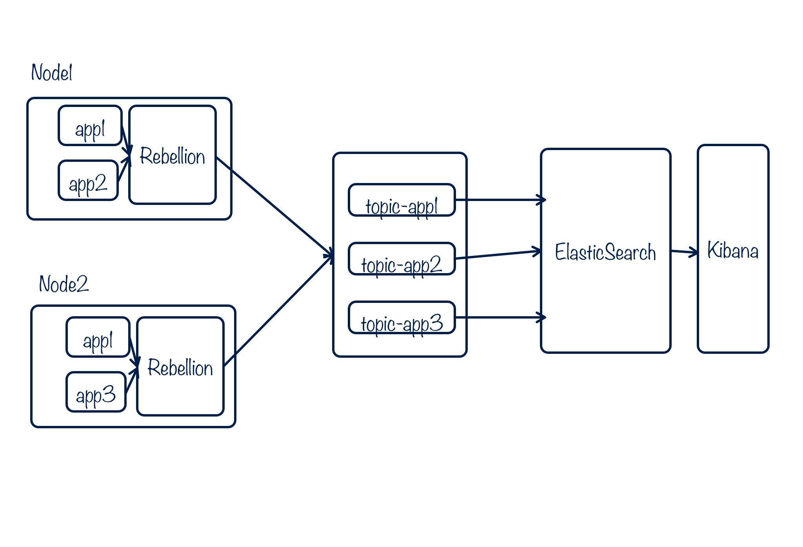

# 基于 Kafka & ELK  的日志系统

### 
Lain 平台已经具备了良好的日志收集能力 (通过基于 Hekad 的 Rebellion 组件)，默认情况下会将容器内的应用日志收集到宿主机某个 volume 目录下，比如 /data/lain/logs/。

如果需要进一步地进行日志的集中化管理/存储/检索，推荐使用 Kafka & ELK 来完成。

Lain 平台 Rebellion 组件同样已经做好了对 Kafka 的支持，需要集群管理员在 EtcD 中设置 Kafka 地址。

### 架构

* Lain 平台上应用内日志被 Rebellion 收集
* 根据 AppName_ProcType_ProcName 组成 Kafka topic 发送给 Kafka
* 通过 LogStash 或者 HekaD 把日志从 Kafka 导入 ElasticSearch
* 用户通过 kibana web 结构化检索日志

###文档
Kafka & ELK 都是非常流行的开源系统，且有良好的文档，从安装到使用以及系统管理/优化都有详尽的说明。
* Kafka:  http://kafka.apache.org/082/documentation.html
* ELK:     https://www.elastic.co/guide/index.html

###几点值得注意的地方
1. Lain 平台收集的日志，在发送给 Kafka 时候，以 `AppName_ProcType_ProcName` 为 topic 名。这意味着在实际使用中，Kafka 中 topic 数量会比较多。
2. Kafka partition 数量的设置，通常为了提高吞吐，会设置得稍高一些。如果是对日志要求严格有序，因为 partition 之间不能保证有序，又会需要将同源的日志发往同一个 partition。这似乎是个矛盾。不过考虑到上述问题 1，Lain 环境下的日志，已经天然地发起了多个 topic。 即使每个 topic 只有一个 partition 用以保证有序，仍然可以在整个 Kafka 集群层面上，保持多个 partition (至少每个 topic 会有一个 partition)，因此不会对吞吐有太大影响
3. 建议每天的日志在 ElasticSearch 中单独建一个 index，方便清理过期日志
4.  Kafka & ELK 仍然在快速迭代中，部分版本升级可能有 API 或者 client 不向下兼容，请在选择版本时候一定注意 changelogs
5.  LogStash 资源占用略高，如果对 Kafka topic 的选择没有太高要求，建议考虑 Hekad 替换
6.  Kibana 界面可以采用 lucene 查询语法，也可以采用 Elasticsearch 风格的查询语法
7.  Elasticsearch 中同一个 index 中的 type，要保持 mapping 一致
8.  LogStash grok filter 中的 NUMBER 默认会在 Elasticsearch 中存储为 string 类型。如果需要做数值类型比较，需要特别声明

###Lain 团队生产环境中使用的版本
* Kafka 0.8.2.1
* ElasticSearch 2.1.0
* LogStash 2.0.0
* Kibana 4.3.1

同时使用了 shield 作为权限控制解决方案。

