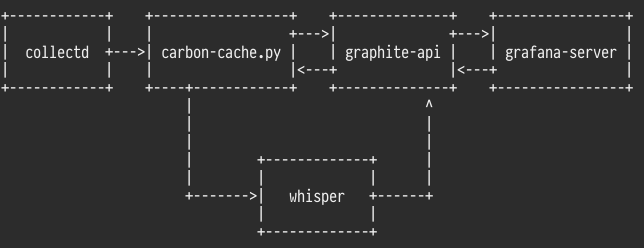

# Hedwig

Hedwig 是一套为 Lain 集群服务的指标收集、汇总、展示、监控系统。

## 结构

## 组件

* [collectd](https://collectd.org/)

* [Graphite](http://graphite.readthedocs.org/)

* [statsdaemon](https://github.com/Vimeo/statsdaemon/)

* [Graphite-API](https://github.com/brutasse/graphite-api)

* [Grafana](http://grafana.org/)

## 用户指南

1. 使用 Hedwig 内的 `lain.yaml` 文件在 Lain 集群中部署 Hedwig 的服务端；

2. 在 networkd 中配置 Hedwig 服务端所需 IP 地址；

3. 运行 `lain/playbooks/roles/collectd` Ansible Role，为节点安装 Hedwig 的客户端，此时节点的系统数据会开始上报；

4. 业务容器也可使用 Stats-D 的接口向 Hedwig 服务端发送数据；

5. 在浏览器中打开 Grafana 查看相应数据。

## 维护指南

* 修改 `lain/playbooks/roles/collectd` Ansbile Role，可添加、删除、修改监控项；

* 修改 `/opt/graphite/conf/*.conf` ，可调整指标接收性能。
