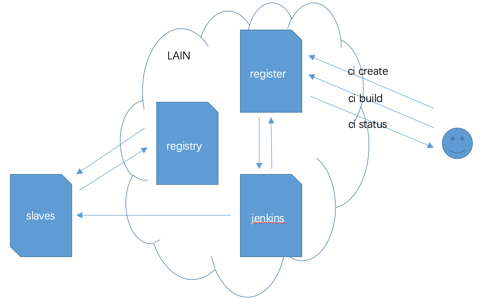

# lain jenkins

### 组件简述

1. jenkins 组件是 lain 集群的可选组件，近似于开箱即用的 ci 工具
2. jenkins 组件需要安装运行了 docker 的集群外的 slave 配合进行镜像的持续构建
3. jenkins 组件提供了模板化的 job 一键创建，job 构建出发，和 job 状态查询 API

### 组件架构



### 使用方法

1. 按照常规的 lain 的应用的编译和部署方法，lain build / lain tag / lain push / lain deploy
2. 自行搭建一个运行 docker 的集群外 slave，接入到上述安装好的 jenkins master
3. 安装必要的 jenkins plugin
4. 接着就可以在 lain CLI 中使用 lain ci 系列指令


### register API

#### 当前的register 是根据repo和watchpoint(branch)唯一确定一个job

- `/api/v1/entrys` 支持 `GET` 和 `POST`
```
sample:
	> get: curl /api/v1/entrys or /api/v1/entrys/<repo> 进行repo过滤
	> post: curl -X POST /api/v1/entrys -d 'repo=jenkins-test2&vcs=http://laingit.bdp.cc/wenbinmeng/alarmmsg2.git&watchpoint=master[&slack_channel=xxx(default #jenkins)]'
```

- `/api/v1/entrys<repo>(默认master分支) or /api/v1/entry/<repo>/<branch>` 支持 `GET` 、 `PATCH` 和 `DELETE`
```
sample:
	> get: curl /api/v1/entry/jenkins-test
	> patch: curl -X PATCH /api/v1/entrys/jenkins-test -d \
	'repo=jenkins-test2&vcs=http://laingit.bdp.cc/wenbinmeng/alarmmsg.git&watchpoint=master'  #暂且别用，rename jenkins api操作有认证的坑，虽然操作成功但是返回错误
	> delete: curl -X DELETE /api/v1/entrys/jenkins-test()
```

-  `/api/v1/entry_details/<repo>(默认master分支) or /api/v1/entry_details/<repo>/<branch>` 支持 `GET` `POST`
```
sample:
	> get: curl /api/v1/entry_details/jenkins-test
	   #显示前TOP_NUM数量的build状态信息及job信息

	> post: curl -X POST /api/v1/entry_details/jenkins-test [-d 'nums=num']
	   #显示前num(default TOP_NUM)数量的build状态信息及job信息
```

-  `/api/v1/entry_builds/repo/<repo>/rvision/<sha1>(默认master分支) or \
	/api/v1/entry_builds/repo/<repo>/branch/<branch>/rvision/<sha1>` 支持 `GET`
```
sample:
	> get: curl /api/v1/entry_detail/<repo_name>/revision/<sha1>
	   #显示指定sha1版本的build状态信息及job信息
```

-  `/api/v1/entry_last_good_build/repo/<repo>(默认master分支) or /api/v1/entry_last_good_build/repo/<repo>/branch/<branch>` 支持 `GET`
```
sample:
	> get: curl /api/v1/entry_last_good_build/repo/<repo>
	   #显示最近一次好的构建信息
```

-  `/api/v1/entry_build` 支持 `POST`
```
sample:
	> post: curl -X POST /api/v1/entry_build -d 'repo=<repo_name>'
	   #构建某个job return404 or 200
```

-  `/api/v1/reloadjenkins` 支持 `POST` 和 `GET`
```
sample:
	> GET: curl -X GET /api/v1/reloadjenkins 
	> post: curl -X POST /api/v1/reloadjenkins 
	   #重新加载jenkins
```
