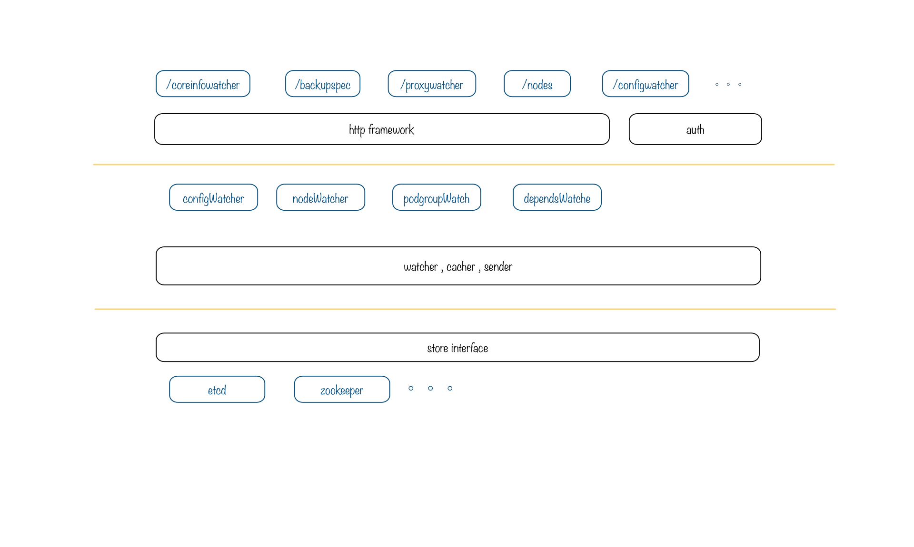

# Lainlet

## 介绍

Lainlet主要负责为Lain集群中各组件和app提供实时的集群状态数据。集群的实时状态由deployd组件更新到etcd中，由于这状态数据结构复杂，不利于其他组件直接读取；而且过多的组件watch etcd会对etcd造成一定的压力。

所以Lainlet的职责，就是从 etcd 中实时获取集群及应用的相关数据。简化数据结构，并提供get和watch的http api供其他组件使用。几乎每个要获取集群数据的组件，都会在Lainlet中有一个特定的api。


## 整体设计

Lainlet内部分三层, 设计的重要目标之一是方便快捷的扩展新的数据结构API。

如图所示:




1. 最下层封装了store接口，方便后端存储换成zookeeper或其他的存储，目前只实现了etcd存储。
1. 中间层为watcher层，实现了通用的broadcast功能和cache数据结构，并封装成watcher接口。configWatcher和nodeWatcher等只是针对不同的key实现etcd的KV结构到cache的KV结构的转换。
1. 最上层http层，通用的watch功能。同样不同的api只需定义自己的数据结构，并实现固定的接口，就可添加新的带有watch功能的api。


## 编译和安装

### 编译
**环境需要: go1.5+**
```sh
go build -o lainlet
```

### 运行
**环境需要: etcd**

```sh
./lainlet -h # 查看运行参数

# 例子
./lainlet -web :9001 -etcd 127.0.0.1:4001 -ip 127.0.0.1 -debug # 监听9001端口
```


## 代码结构

```
root
 |_api  // 第一层, v2目录下,每个api是一个单独的.go文件
 |  |_ v2/         // v2版本的api
 |  |_ event.go    // 处理watch功能的event相关函数, 弃用旧版本的eventsource package
 |  |_ server.go   // 初始化http server framework, 并实现些通用的 middleware 和 function
 |  |_ maker.go    // 定义一个新的api需要实现的interface
 |
 |_auth // 基于watcher实现的auth功能, 默认开启,可通过-noauth参数关闭
 |
 |_watcher  //第二层
 |  |_config       // `/lain/config/`
 |  |_podgroup     // `/lain/deployd/pod_group/<appname>`
 |  |_container    // 对`/lain/deployd/pod_group/`下的数据创建<nodename>/<containerid>索引后的数据
 |  |_depends      //  `/lain/deployd/depends/pods`
 |  |_nodes        // `/lain/nodes/nodes`
 |  |
 |  |_watcher.go   // 通用watcher模块, 监听store并广播
 |  |_sender.go    // 通用广播模块, 负责接收watch请求，并广播
 |  |_cacher.go    // 通用cache模块,从etcd拿到的数据cache到这里
 |
 |
 |_store  //第三层
 |  |_store.go   // store 接口
 |  |_etcd        // etcd 存储模块
 |
 |_client  // lainlet的客户端库
 |_Godeps  // 依赖库

```

## 功能开发

1. 在`api/v2/`目录下创建新的`.go`文件, 以`newapi.go`为例
2. 在`newapi.go`文件中，定义api使用的数据结构, 并实现API及Watcher接口

    ```golang
    type API interface {
            // decode the data
            Decode([]byte) error

            // encode the data
            Encode() ([]byte, error)

            // the http route uri for this api
            URI() string

            // which watcher want to use
            WatcherName() string

            // the key used to watch,
            // eg. return '/lain/config/vip' for coreinfoWatcher,
            //     return 'console' as appname for coreifnoWacher and podgroupWatcher
            Key(r *http.Request) (string, error)

            // create new api by data
            Make(data map[string]interface{}) (API, error)
    }

    // 如果想禁用watch功能, 可实现BanWatch接口, 写个空函数就行
    type BanWatcher interface {
            BanWatch()
    }

    ```

3. 在main.go的main函数下面注册新API, eg.`server.Register(new(apiv2.NewAPI))`。注册函数会自动给uri加上`/v2/`前缀


### 若有什么特殊需求，可用原生的方法，步骤如下:

1. 在`api/v2/`目录下创建新的`.go`文件, 在其中实现一个函数,形如:
    ```golang
    // 函数的参数用到什么写什么，目前支持 `http.ResponseWriter`,`*http.Request`,`*api.EventSource`,`context.Context`,`martini.Context`
    func VipWatcher(w http.ResponseWriter, r *http.Request, es *api.EventSource, ctx context.Context) {
        // ....
    }
    ```

2. 在`main.go`最下面定义路由, 加上一行代码,如:
   ```golang
	server.Get("/vipconfwatcher/", config.VipWatcher)
   ```
3. `go build`构建测试

## API

### 所有的API的通用规则:
1. 默认情况下，api都是非watch的，就像很普通的Get请求。
   如果需要需要watch功能, 可在相应api后添加`watch=1`或`watch=true`参数. (`watch=0`或`watch=false`表示非watch)

2. 所有的watch请求, 都可设置heartbeat参数,表示心跳事件. 如`?heartbeat=5`表示每5秒发送一个心跳事件. 不设置或设置成0表示不使用心跳,就不会有心跳event返回

3. 所有的watch请求, 返回值格式均为:
   ```
    id: uint // id只有在init 和 update时候为正整数，从1开始一次递增。error和heartbeat event id均为0
    event: string // "init", "update", "delete", "error"或 "heartbeat"
    data: string // heartbeat event没有此项, error event的data为错误说明
   ```
   而对于Get请求, 返回值是watch请求的data部分.

### API列表(Deprecated)

#### `/v2/configwatcher?target=<target>`
返回`/lain/config/<target>`的值, 接收参数target, 如果不指定，则返回所有的配置值。格式为json

旧版本的`/vipconfwatcher`等同于`/configwatcher?target=vip`, 其他的几个同理.

#### `/v2/procwatcher`
返回`/lain/config/pod_group/<appname>`的精简结构

#### `/v2/coreinfowatcher`
返回`/lain/deployd/core_info/<appname>`的值, 可接受参数`appname`, 如果不给定appname，则返回所有app的coreinfo信息

#### `/v2/localspecwatcher`
返回跑在指定ip上的所有的proc的name列表. 可接收参数`nodeip`, 如果不给定`nodeip`，则使用lainlet的本机

#### `/v2/proxywatcher`
专给proxy用的api, podgroup的一个精简版本

#### `/v2/depends`
返回 `/lain/deployd/depends/pods`下的数据的简化版本

#### `/v2/nodes`
返回 `/lain/nodes/nodes`下的数据的简化版本

#### `/v2/containers?nodename=<name>`
返回 某节点下所有container的信息列表

#### `/v2/webrouter/webprocs`
返回所有web类型的proc的信息，数据结构和coreinfo类似，但是只包含container IP, Expose和Annotation信息

#### `/v2/rebellion/localprocs`
返回所有本地的proc的信息，数据结构和coreinfo类似，但是只包含Annotation和InstanceNo信息

### 其他API

#### `/debug`
返回lainlet的debug信息

#### `/version`
返回lainlet的版本信息

## 已知问题:

1. 如果lain集群的node数增加到100+，每个node上一个lainlet, 每个lainletwatch etcd的连接数大约10个左右。
   这样整个etcd集群就是承受1000+的watch连接，etcd集群是无法承受这个数量级连接的。
