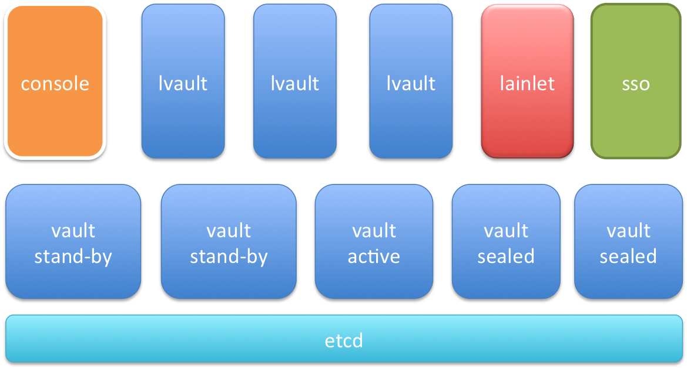
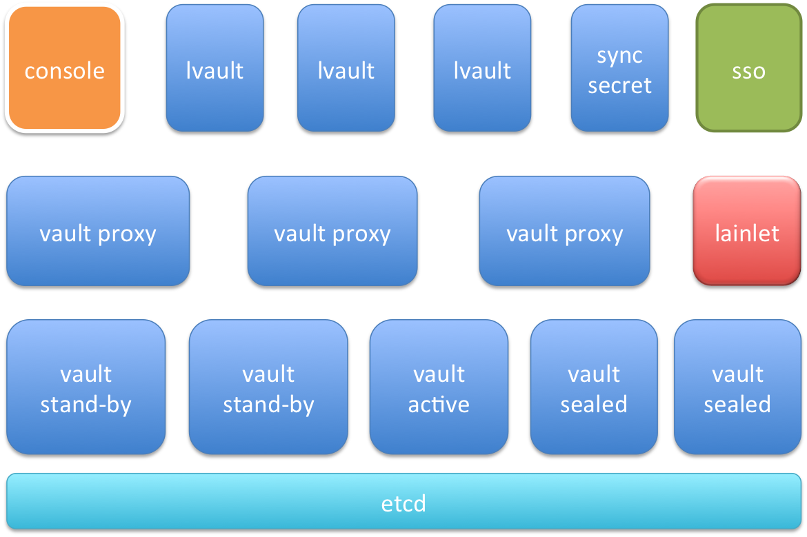

#lvault 简介

lvault 是 lain 为应用提供加密存储一些秘密配置文件的组件，本身作为 lain 的一个 layer 1 应用。

在经过 sso 的身份认证，console 的授权后，应用管理者可以向 lvault 写入秘密配置文件.

##整体设计 (lvault-v2)

lvault 的用户为应用管理者 (app maintainer)，下图为 lvault 涉及的主要组件的结构图.

主要分为三层，

- 最上层为 lvault.web.lvault proc 及其依赖的组件，功能为
	- 与用户的交互，包括一个简单的 UI
	- 处理与 lain 相关的逻辑
		- sso 为应用管理者做身份认证
		- console 授权应用管理者写某应用的秘密文件的权限
	- 作为 vault 的智能代理
		- 依赖 lainlet，自动识别 vault 集群的可用性
- 中间一层为 lvault.web.web proc，直接利用开源组件 [vault](https://www.vaultproject.io) 搭建的 vault 集群。
	- sealed: sealed 的含义是，该节点的内存没有 master key，从而无法解密存储在 etcd 中的密文 
- 最下层是 vault 集群的存储后端 etcd. 当前 vault 相关内容写在 /vault 下

lvault 的两个 proc 均支持 HA.

### 安全性

1. 集群打开认证后，不同应用的 secret files 是互不可见的
	- console 利用 sso 的组管理，为每个应用生成应用管理者组，只有在该组的用户才有权限读写删 secret files
1. vault 的 key 与 token 的管理，只在内存中
	- key 用于加密和解密，token 用于 lvault 内部的权限管理
	- 可以调用 vault 的 api，更新 key 或 token. 
1. 存储后端为 etcd，文件均为加密存储，加密算法为 AES 256 位

##附 lvault v1 结构图

