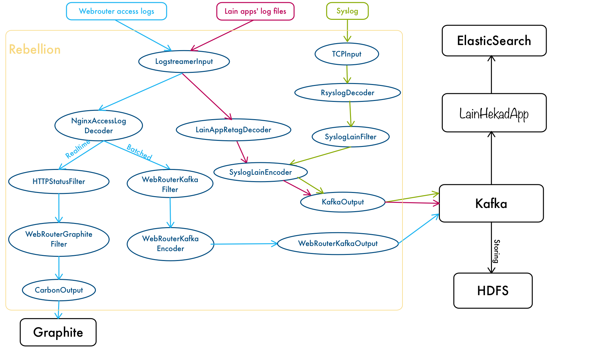

# Rebellion
## 1. 功能说明
### 1.1 基本功能
Rebellion是lain中负责管理日志数据的layer0组件, 以host模式运行在docker上。但Rebellion并不是单进程的容器，而是由supervisord管理的多进程容器。Rebellion主要包括两个部分：
- Hekad程序：负责接受日志输入、处理并发送。
- Rebellion程序：负责在启动时生成Hekad的配置文件。并监听lainlet，当集群配置更新或应用更新时，及时更新Hekad的配置文件并重启Hekad。

> hekalain的代码仓库 http://laingit.bdp.cc/lain/hekalain.git

> heka的官方文档地址 http://hekad.readthedocs.org/en/v0.10.0/

### 1.2 日志流

Rebellion处理的日志流如下图所示。



Rebellion目前主要处理三类日志流：

- Docker的Syslog：Rebellion通过Host模式绑定主机的8178端口，接收来自rsyslog的日志输入，并通过RsyslogDecoder解析，通过SyslogLainFilter加工，然后通过KafkaOutput输出至Kafka。

- LainApp的log文件：Rebellion通过只读形式volume的/data/lain/volume文件夹，用LogStreamerInput读取应用配置的日志文件，在LainAppRetagDecoder中解析并加工成和syslog兼容的日志格式，发给Kafka。

- Webrouter的access log：Rebellion通过LogStreamerInput读取webrouter volume出来的*.access.log文件，使用hekad自带的NginxAccessLogDecoder解析得到每个请求的结构化日志。该日志会同时以实时和批量的形式进行处理：
  - 实时监控：结构化的access log会交给HTTPStatusFilter进行QPM，平均响应时间，5XX错误的统计，HTTPStatusFilter会按照配置的ticker_interval定时发送消息给Graphite做监控。
  - 批量发送：结构化的access log会交给WebRouterKafkaFilter加工（增加topic和host)，然后交给Kafka做进一步的分析。


## 2. 编译运行环境

### 2.1 编译方式
运行项目中的build.sh即可完成一键发布，前提是jenkins上应该已经有发布的hekalain。

> Dockerfile是编译时运行的文件

> Dockerfile.release是发布时运行的文件

Jenkins上面已经配置好了本工程的自动构建(lain-rebellion\_\_release\_\_)，构建时会执行build.sh脚本。构建成功后会上传image至docker.bdp.cc:5002。版本更新时，务必更新build.sh和main.go里面的版本号，该版本号对应了image的tag。

### 2.2 运行方式
Rebellion的运行是以Host模式运行的Container，目前已经作为Service在boostrap时就已经部署并运行了。
Service中运行的指令为：

```bash
docker run --name rebellion.service --rm --net="host" \
-p 8178:8178/tcp -e NODE_NAME={{ node_name }} -e LAINLET_PORT={{ lainlet_port }} -e GRAPHITE_PORT={{ graphite_port }} \
-v /data/lain/volumes/:/data/lain/volumes/:ro -v /data/lain/rebellion/heka/cache/:/data/heka/cache -v {{ lain_data_dir }}/rebellion/logs/:/var/log/supervisor/ {{ rebellion_image }}
```

运行时的参数说明如下
- ```--net=host``` 以host模式运行。
- ```-p 8178:8178/tcp``` 绑定host的8178(rsyslog)端口。
- ```-e NODE_NAME={{ node_name }} -e LAINLET_PORT={{ lainlet_port }} -e GRAPHITE_PORT={{ graphite_port }}``` 设置环境变量NODE_NAME为主机的host_name，设置环境变量LAINLET_PORT, GRAPHITE_PORT为集群bootstrap时的lainlet_port和graphite_port。
- ```-v /data/lain/volumes/:/data/lain/volumes/:ro``` 以只读模式挂载lain的volume目录。
- ```-v /data/lain/rebellion/heka/cache/:/data/heka/cache``` 将heka的cache目录挂载到宿主机上，cache记录了读取的文件的位置等重要信息，防止升级rebellion时丢失。
- ```-v {{ lain_data_dir }}/rebellion/logs/:/var/log/supervisor/``` 挂载Rebellion本身的日志文件，可选。

> 目前由于所有的日志都发送至Kafka，所以部署时集群应该在etcd中配置了/lain/config/kafka

## 3. 扩展Rebellion

目前Rebellion是以渲染hekad的配置模板的方式进行动态配置hekad。所有模板都放在templates文件夹下。模板语法以及渲染方式都是golang text/template包原生的。

渲染方式主要有两种，静态渲染和动态渲染。

- 静态渲染：静态渲染是指在Rebellion启动时只渲染一遍，之后不会再次渲染。这类渲染的配置一般都是全局配置或者单实例配置。如果需要增加静态渲染的功能，在写好模板的基础上，在core中实现```StaticHandler```接口。该接口定义如下：

    ```go
type StaticHandler interface {
      StaticallyHandle()
}
    ```

  并在NewRebellion中注册该实现的结构体。StaticallyHandle()实现时需要自己调用renderTemplate()函数进行模板渲染。

  > 示例: [CommonConfHandler](http://laingit.bdp.cc/lain/rebellion/blob/master/core/common.go)

- 动态渲染：动态渲染是指在Rebellion启动后会根据情况多次渲染。这类渲染的配置一般都和集群或应用配置相关。如果需要增加动态渲染的功能，在写好模板的基础上，在core中实现```DynamicHandler```接口。该接口定义如下：

    ```go
type DynamicHandler interface {
      DynamicallyHandle(chan int)
}
    ```

  并在NewRebellion中注册该实现的结构体。DynamicallyHandle()实现时需要自己调用renderTemplate()函数进行模板渲染，并通过给channel发送任意的int值通知rebellion重启hekad，以使新配置生效。动态渲染的冷却时间是3秒。

  > 示例: [WebrouterConfHandler](http://laingit.bdp.cc/lain/rebellion/blob/master/core/webrouter.go)
