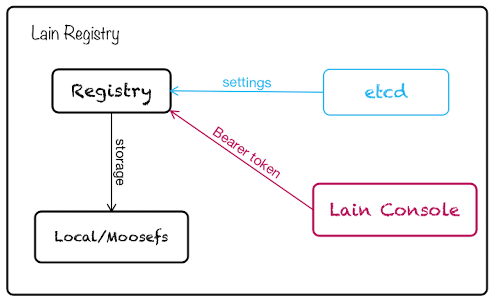

# LAIN Registry

## 组件描述
LAIN Registry 组件在 LAIN 中主要用于 Image 存储，集群中所有的 Image 都由 LAIN Registry 组件提供及存储。组件目前使用的 Registry 的版本为 V2.4.0，关于 Registry 的官方具体描述可以参见[这里](https://github.com/docker/distribution)。

LAIN Registry 组件在 Docker Registry 版本的基础上进行了 LAIN 化。SA 可以在 etcd 中进行一些配置，以更新 Registry 相应的设置，包括后段存储、Auth设置等。LAIN Registry 组件默认使用本地磁盘作为存储后端，默认不使用 Auth。

## 组件顶层设计

LAIN Registry 仓库地址为： `https://github.com/laincloud/registry.git`

LAIN Registry 的组件架构图如下所示：

在启动 LAIN Registry Container 时，会从 etcd 中读取一些配置，然后以这些配置为基础结合提供的 config.yml 文件运行 Registry。

默认情况下组件会将 Image 存放在本地磁盘的 `/var/lib/registry` 目录下(LAIN bootstrap 时设置)，也可以通过配置 moosfs 等来实现集群分布式存储；

默认情况下组件不开启 Auth，但是 LAIN 中也提供了 Registry 的 auth server，即 LAIN Console，可以在 etcd 中设置相应的 Auth 信息，LAIN 中使用的 Registry Auth 方式遵照官方实现，具体可以参见[这里](https://docs.docker.com/registry/spec/auth/token/)

## Registry 基本使用

### 1. install
1. 获取registry src: git clone https://github.com/docker/distribution.git

2. 指定至具体版本: git checkout v2.4.0

3. 编译: make PREFIX=/go clean binaries (PREFIX 路径根据实际情况改动)

4. 在/go目录下会生成对应二进制文件: registry

### 2. 配置
Registry 配置主要是针对日志，存储，auth，middleware，外界访问(http)，通知，缓存，代理及兼容性配置,并将相关配置写入 config.yaml。

详细配置信息见[官网](https://docs.docker.com/registry/configuration/)

### 3. 启动
1. 将registry移动至/usr/bin目录

2. 运行命令：registry serve config.yml

### 4. registry 使用
Assume Registry addr: localhost:5000 

1. build image: build -o myfirstimage . （Current work dir contains Dockerfile）

2. tag image: docker tag myfirstimage localhost:5000/myfirstimage

3. login(when auth required): docker login localhost:5000 (Enter Username, Password, Email(Optional))

4. push image: docker push localhost:5000/myfirstimage

5. pull image: docker pull localhost:5000/myfirstimage

## Registry in LAIN

### 1. 运行方式
1. LAIN Registry以Container的方式运行于LAIN中，由bootstrap 启动运行。

2. registry url 为: registry.{domin}，访问时需要修改Host至 node1 ip。

3. 默认的存储方式为filesystem，当然也可以支持S3，OSS等方式，需要自己配置。

4. 默认为no auth，可以通过lainctl 开启auth

5. auth规则由console控制

### 2. Role in LAIN
1. registry 与 lain-cli, console(layer1) 及 deployd(layer0) 关联。

2. 用户部署 LAIN 应用时，lain cli会将相关应用的镜像 push 到 LAIN registry 中，并向 console 中注册应用信息。

3. deployd 根据应用信息从 LAIN registry pull 镜像，并在 LAIN 中分配资源运行应用，也就是运行 pull 下来的应用。

4. 在lain push时如果开启了auth， 需要先进行lain login。

### 3. 使用方式
主要应用于应用lain-cli发布，基本使用方式同[registry 使用](#use)。

## Develop based on LAIN Registry

在 LAIN Registry 基础上进行定制时，建议开发者在 fork 代码后，可以重新设置 config.yaml 的内容，并在此基础上重新编译 registry 并进行更新。在使用公有云服务时，可以选择使用 S3 存储后端，并将 registry scale 成多个实例，对于 registry 的 HA 也会有很大的提升。
