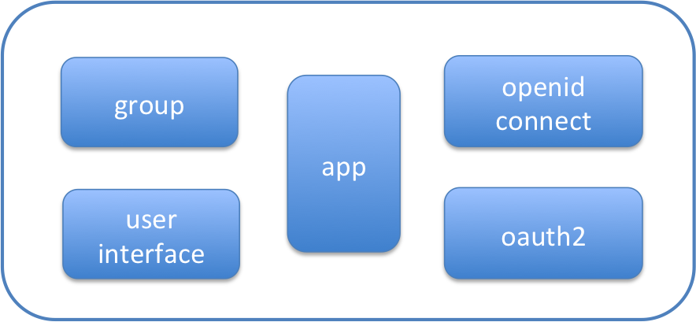

# sso 简介

sso 即单点登录系统，是 lain 的一个组件，用于 lain 上用户的身份认证。

主要有两大功能，第一个是作为授权服务器（Authorization Server），简称 AS, 
实现了 oauth2 的 code flow 和 implicit flow, 并部分支持 openid connect.
第二个功能作为 Identity Provider, 实现了用户及组的管理，为 lain 的授权提供底层支持。

##项目简介

sso 分为三个工程 sso-mysql, sso-ldap, ssolib, ssolib 是核心。

下图是 ssolib 的结构图

sso-mysql 和 sso-ldap 为 user interface 的两种不同实现. 

## SSOLIB

### 模型

SSOLIB 首先建立在 OAuth2 协议上，并部分（到目前为止）实现了建立在 OAuth2 协议之上的 OpenID Connect 协议.

从 oauth2 的角度看，sso 首先是一个 AS， lain 的应用为它的 Client. 
lain 的应用同时兼任 RP(Resource Provider). sso 也是作为 AS 的 sso 的应用，主要功能便是用户和组的管理.
所以 sso 内部模型包含用户管理模型和应用管理模型. 这里所说的应用从 oauth2 的角度看便是 client. 

为了方便 sso 的 client 方便做权限管理，sso 提供了组的模型，每个 sso 的用户都可以创建组，并包含一些特定的用户。
这样，lain 的应用管理者便可以创建和应用权限相关的组，配合应用做权限管理。

在 oauth2 的基础上，为了向业界的协议靠拢，sso 实现了部分的 openid connect 协议.
从 oidc 的角度看，sso 也承担了 Identity Providers 的功能.

但是，目前 Lain 上的登录授权系统有一些额外的复杂性，
主要体现在如下方面：
- sso 的 client 有可能同时担任资源服务器，而 sso 仅提供用户系统，比如 lvault，lvault 提供秘密文件的存储，同时又是 sso 的 client.
- console 不仅仅作为一个资源服务器(RP), console 还承担了很多授权的功能，主要体现在对应用管理者的授权，而授权的基础为 sso 中 console 建立的组。
- sso 的 client 可能既是资源服务器，又依赖其它 lain 上的作为 sso client 的应用, 如 console 在管理用户的秘密文件时依赖 lvault.

UserInfo endpoint: 

### sso 权限
sso 提供了组管理和用户管理功能，可以看成是 oauth2 的资源服务器，所以存在自我授权的环节。

组的管理员：拥有对该组的直接用户成员和组成员的增删操作权限，拥有删除组的权限。
sso 的管理员：sso admins 组里所包含的用户；拥有删除 sso 的用户的权限. 

### 用户身份认证

当前仅支持**用户名／密码验证**用户身份

## SSO-mysql

## 功能Demo

查看 https://sso.`LAIN_DOMAIN`/.well-known/openid-configuration
利用标准的 oauth2 workflow 即可.

1. login with sso code flow
参见 [ sso 用户文档](../../usermanual/sso/sso.md#Authentication code flow)

1. login with sso implict flow
一般来说，用于 User Agent 为浏览器的情形，参见[ sso 用户文档](../../usermanual/sso/sso.md#利用 implicit flow 认证)

1. sso nginx proxy
参见文档 [nginx-proxy](proxy.html)
