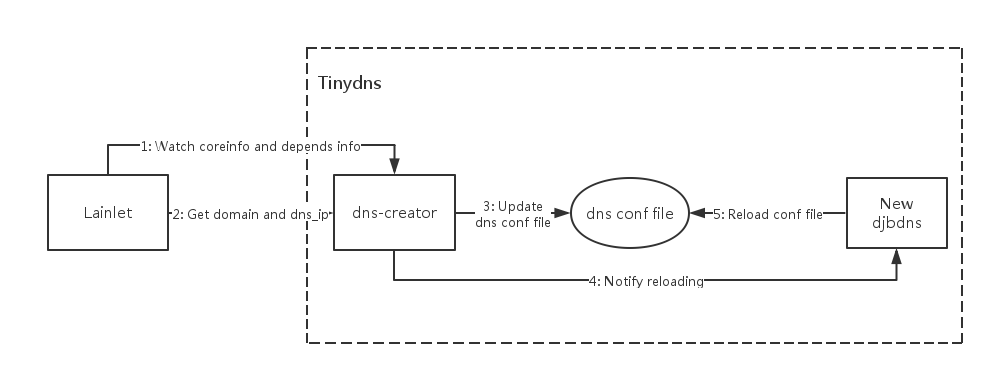

# Tinydns
## 1. 功能简介
作为Lain集群中重要的layer1组件，tinydns 是一个轻量级的域名解析服务，负责集群中应用内部各个proc之间的`proc_name-instance_no`的地址解析，和use_service时，`service_name`的地址解析。应用升级，或容器迁移后，proc的各个instance的IP地址有可能发生变化，`proc_name-instance_no`和`service_name`是应用内部以及应用与service/resource通信定位的唯一依据，因此tinydns配置的正确性与高可用性是应用能够正常运转的基础。

Lain的tinydns特点如下：
- 支持主备：当部署的tinydns的实例个数大于1时，Lain的**networkd**组件会自动监听所有的tinydns实例的工作状态，并将DNS的虚拟IP绑定到某一个正常工作的tinydns实例所在的节点上。如果该实例出现问题，**networkd**也会及时地将该虚拟IP迁移到正常的容器所在的节点上。tinydns各个实例之间则不会相互影响。
- 动态配置更新：tinydns会监听Lain的**lainlet**组件，一旦有应用部署、更新、删除，tinydns会根据更新后的信息更新自己的DNS配置文件。该更新功能是瞬时的，几乎不会被其他应用感知。
- 低能耗：tinydns占用的系统资源很少，每个容器只需要200MB左右的内存即可正常高效工作。在运行时CPU的占用也较低。
- 无状态：tinydns是无状态的应用，可以直接迁移。

> Tinydns所依赖的lain组件：
> - lainlet
> - networkd(需要负载均衡或HA时依赖)

## 2. 应用架构与工作流程
Tinydns由Supervisor管理以下两个进程：
- [**New djbdns**](http://pjp.dgplug.org/ndjbdns/)：提供DNS服务的进程。
- **dns-creator**：负责监听**lainlet**，动态更新DNS配置文件，并通知**New djbdns**重新加载DNS配置文件。

Tinydns中**New djbdns**、**dns-creator**与Lain的**lainlet**架构如下图

当tinydns开始运行后，其工作流程为：
1.  **dns-creator**监听**lainlet**的`/v2/coreinfowatcher`和`/v2/depends`接口。当有应用更新时，**lainlet**的`/v2/coreinfowatcher`接口会推送更新事件；当有use_service的应用更新时，`/v2/depends`接口会推送更新事件。
1.  **dns-creator**从**lainlet**中获得集群的`dns_ip`和`domain`的配置信息。
1.  **dns-creator**根据1和2中的数据生成新的dns配置文件。
> 生成配置文件的内容包括：
> - 应用内部proc之间的地址解析：`=$proc_name-$instance_no.$domain.lain:$container_ip:300`
> - 应用到portal的单向地址解析：`=$service_name.$app_name.lain:$portal_ip::$node_ip`
> - 内部IP反解：`.20.172.in-addr.arpa:$dns_ip:a:300`
> - 外部域解析：`+*.$domain:$dns_ip:300`
> - 内部域解析：`.lain:$dns_ip:a:300`
> - 权威dns配置：`.$domain:$dns_ip:a:300`

1.  **dns-creator**通知**New djbdns**重新加载DNS配置文件，并重新进入监听状态。
> 配置文件的位置为 `/etc/ndjbdns/data`
1. **New djbdns**重新加载DNS配置文件，DNS配置更新完成。
