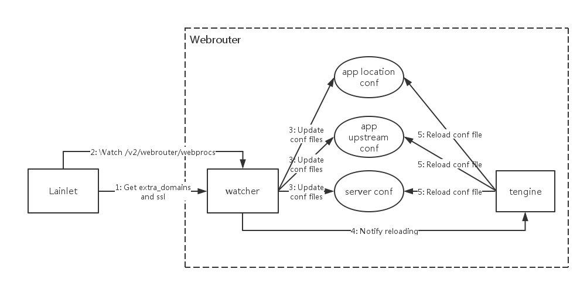

# Webrouter

## 1. 应用简介
作为 LAIN 中layer1的重要应用，Webrouter 对外提供了对集群内应用的HTTP/HTTPs 的访问功能，是外部客户端访问 LAIN 中 Web 应用的唯一入口。所有访问 `http://mountpoint/location` 和 `https://mountpoint/location` 的请求都会发送到 webrouter 中，并转发至其配置的 upstream。

Webrouter 的特性：
- 及时更新 Upstream：Webrouter 能够及时根据应用的 web proc 中配置的 mountpoint 更新 upstream 配置文件。
- HTTPs 支持：如果对于安全性要求较高，强烈推荐在 LAIN 集群中开启 HTTPs 功能。Webrouter 支持根据自己的域名证书接受 HTTPs 的请求。
- 完善的访问日志收集与查询：Webrouter 会详细记录所有的访问日志。如果集群配置了 **kafka**，可以在 **kafka** 中查询到访问每个 upstream 的日志。
- 支持主备：当部署的 Webrouter 的实例个数大于1时，LAIN 的 networkd 组件会自动监听所有的 Webrouter 实例的工作状态，并将 Webrouter 的虚拟 IP 绑定到某一个正常工作的 Webrouter 实例所在的节点上。如果该实例出现问题，networkd 也会及时地将该虚拟IP迁移到正常的容器所在的节点上。Webrouter 各个实例之间则不会相互影响。

> Webrouter依赖的组件：
> - lainlet（必需）
> - networkd（必需）
> - rebellion （可选，日志收集）
> - kafka （可选，日志收集查询）
> - graphite (可选，配置文件语法合法性监控)

## 2. 架构与工作流程
Webrouter 是由 Supervisor 实现进程管理的，实际工作的进程包括 [tengine](http://tengine.taobao.org/) 和 watcher：
- **tengine**:  负责处理H TTP/HTTPs请求。
- **watcher**: 负责监听集群应用的 web proc 的 mountpoint 变化，更新 upstream 的配置，并通知 **tengine** reload 配置。同时还会定期检测所有配置文件的语法合法性，防止刷新时出现中间状态导致配置失效。如果配置了监控系统，**watcher** 还会将检查结果以及更新配置的结果发送到监控系统。

Webrouter 的工作流程如下图：

其工作流程为：
1.  **watcher** 从 lainlet 中获取 `extra_domains` 和 `ssl` 的配置信息。
2.  监听 **lainlet** 的 `/v2/webrouter/webprocs` 接口。当有应用的 web proc 更新时， **watcher** 会从监听中获得 web proc 的 `containerIP`，`expose` 和 `mountpoint`。
3.  **watcher** 根据1和2中的数据生成新的 **tengine** 配置文件。

> 生成配置文件在 `/etc/nginx/` 下，包括以下三类：
> - server: 定义了 `appname.domain` 以及 web proc 的 `mountpoint` 里写的域。同时还包括访问该 `appname.domain` 时，是否支持HTTPs，如果支持则还指定了证书位置。文件位置为 `conf.d/appname.domain.conf`。
> - upstream: 定义了 `appname.domain` 以及 web proc 的 `mountpoint` 里写的域。同时还包括访问该 `appname.domain` 时，是否支持 HTTPs，如果支持则还指定了证书位置。文件位置为 `upstreams/appname.upstreams`。
> - location: 针对 lain.yaml 中配置的 `mountpoint`，定义了访问该`mountpoint` 时实际对应的 upstream，以及相应的访问日志位置。文件位置为 `locations/mountpoint/upstream_name`。

4.  **watcher** 通知 **tengine** 重新加载配置文件，并重新进入监听状态。
5.  **tengine** 重新加载配置文件，更新完成。
