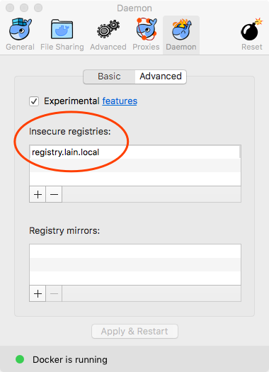
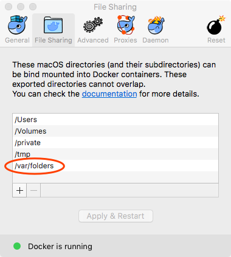

# 安装 LAIN 客户端

开发 LAIN 应用时，需要安装 LAIN 客户端。LAIN 客户端依赖于：
- docker
- python

只要支持 docker 和 python 的系统，就可以使用 LAIN 客户端，比如 Linux 和 macOS。

> 以下均假设 LAIN 集群的 domain 为 `lain.local`，对于其他 domain，将下文中的 `lain.local` 替换即可。

## 安装与配置 docker

### 安装

请参考 https://docs.docker.com/engine/installation/ 安装 docker >= 1.12。

### 配置

#### Insecure Registries

安装好之后，请参考 https://docs.docker.com/registry/insecure/ 将 `registry.lain.local` 添加进
docker daemon 的 `insecure-registries` 选项。

例如，在 Linux 上，如下的 `/etc/docker/daemon.json` 表示将 `registry.lain.local` 加入了
`insecure-registries`：

```
{
  "insecure-registries" : ["registry.lain.local"]
}
```

macOS 上的 insecure registries 配置如下图所示：



> 配置 `insecure-registries` 是因为 LAIN 集群的镜像仓库只提供了 HTTP 服务，没有提供 HTTPS 服务。

#### File Sharing（macOS 用户需要配置）

另外，在 macOS 上，请将 `/var/folders` 加入 `File Sharing` 配置，如下图所示：



> - 配置 `File Sharing` 是因为在 macOS 上，lain-cli 会在 /var/folders 下创建临时文件，
>   而 docker daemon 可能没有权限访问这个文件夹。
> - `lain-cli` 会在 `/var/folders` 下创建文件是因为这个目录是 macOS 系统的临时文件目录。

## 安装与配置 lain-cli

```
pip install lain-cli
```

> 推荐使用 [virtualenv](https://virtualenv.pypa.io/en/stable/) 安装这个 python 包，即：
>
> ```
> pip install virtualenv  # 安装 virtualenv
> virtualenv lain  # lain 是虚拟环境的名字，也可以取其他名字
> source lain/bin/activate  # 激活 lain 虚拟环境
> pip install lain-cli
> deactivate  # 退出 lain 虚拟环境
> ```
>
> 以后需要使用 lain-cli 的时候，用 `source ${lain-virtualenv-path}/bin/activate` 激活 lain 虚拟环境；
> 不使用 lain-cli 的时候，用 `deactivate` 退出 lain 虚拟环境

安装好之后，需要配置 lain-cli，让 lain-cli 知道 LAIN 集群的 Domain 等信息：

```
lain config show  # 显示当前配置
lain config save-global private_docker_registry registry.lain.local # 配置 docker 私有仓库
lain config save local domain lain.local  # 保存 lain.local 集群，并取名为 local
```

> 假如 LAIN 集群开启了 sso 验证（默认未开启），请配置 sso：
>
> ```
> lain config save local sso_url https://sso.lain.local
> ```

## 配置 LAIN 组件的域名解析

如果 LAIN 集群不能在公网上解析（比如本地启动的集群），请配置 /etc/hosts。

如果启动集群时，使用了 `vip` 模式，即使用了
`/vagrant/bootstrap -r registry.aliyuncs.com/laincloud --vip=192.168.77.201`
启动，请执行：

```
echo "192.168.77.201  registry.lain.local console.lain.local entry.lain.local lvault.lain.local ipaddr-client.lain.local ipaddr-service.lain.local ipaddr-client.ipaddr-resource.resource.lain.local" >> /etc/hosts
```

> `192.168.77.201` 是启动集群时的 vip 参数

如果启动集群时，没有使用 `vip` 模式，即使用了
`/vagrant/bootstrap -r registry.aliyuncs.com/laincloud`
启动，请执行：

```
echo "192.168.77.21  registry.lain.local console.lain.local entry.lain.local lvault.lain.local ipaddr-client.lain.local ipaddr-service.lain.local ipaddr-client.ipaddr-resource.resource.lain.local" >> /etc/hosts
```

> `192.168.77.21` 是集群的主节点的 IP，即启动集群的节点的 IP
