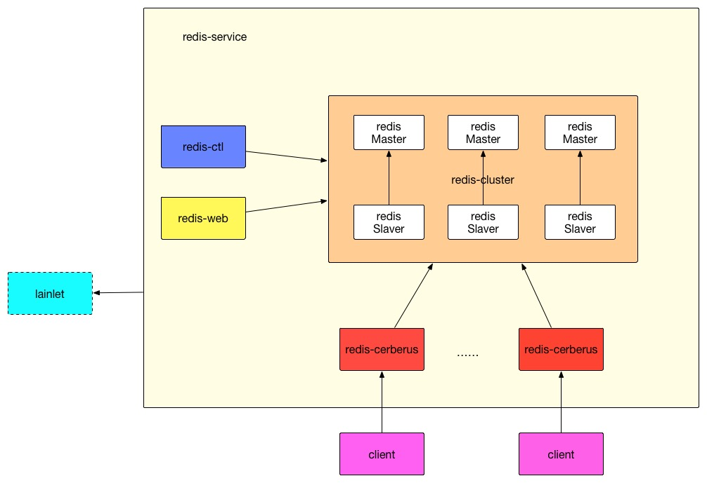
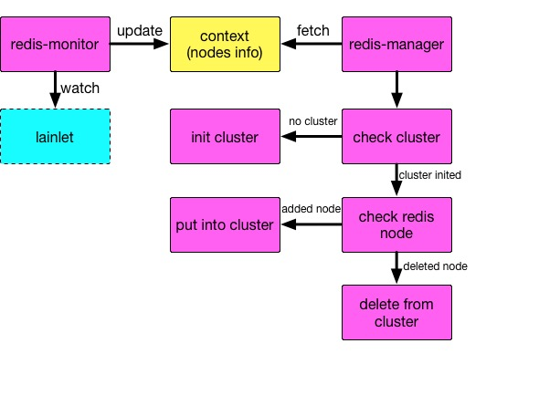
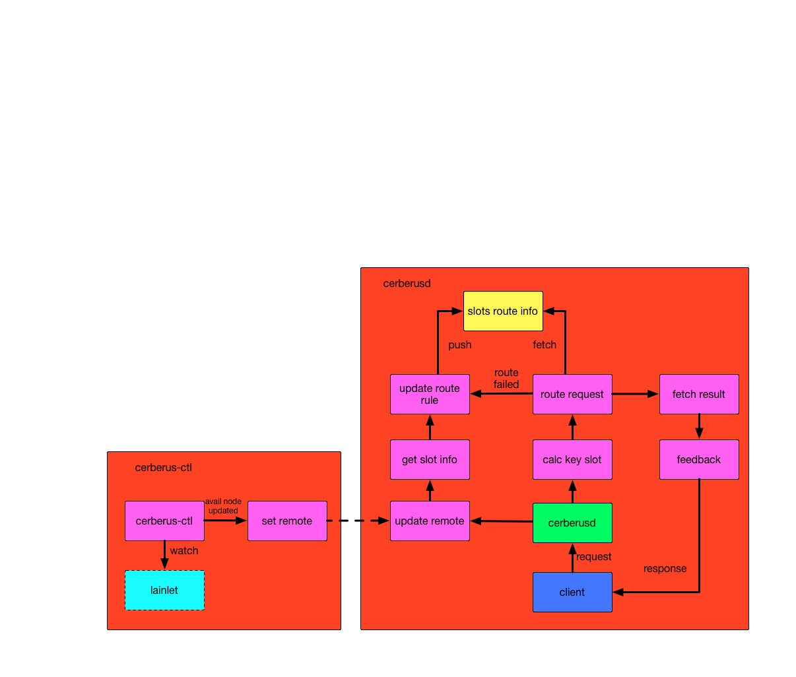

# 基本介绍

redis-service 是基于redis3.0之后对redis cluster的自动化运维管理<br/>
对于redis cluster的介绍可以见[官方文档](http://redis.io/topics/cluster-tutorial)<br/>
文档对于单个redis Server都称作：redis节点
由于多master 槽位分摊的情况存在对于许多redis的操作会无法支持：
主要包括同时对多个key进行操作的command 如mget, mset等

# 整体设计：
整体设计图：


```
redis-service 主要包括四个部分：
1.redis-cluster  以一主一备方式存在的redis cluster服务集群
2.redis-ctl      redis cluster的自动化管理程序
3.redis-web      redis cluster的手动化管理web程序
4.redis-cerberus 与客户端连接的redis cluster代理

其中redis-ctl,redis-web,redis-cerberus分别从lainlet获取分配给service的redis cluster节点信息
redis-ctl      从lainlet中获取redis节点信息，初始化集群，并检查维护集群状态
redis-web      从lainlet中获取redis节点信息，并显示集群节点的相关信息，并提供手动管理
redis-cerberus 从lainlet中获取redis节点信息，并选取可达的有效节点设置为cerberus的remote，
然后由cerberusd根据remote节点信息获取集群整体状态以便将客户请求路由到相关节点
```

## 1.redis-ctl 设计


```
redis-ctl 负责redis cluster的初始化及以后集群状态维护工作
包括两个daemon线程:redis_monitor,redis_manager
1. redis_monitor 从lainlet获取分配给redis cluster的redis节点信息，方便redis集群的伸缩，
并将信息更新到全局context中
2. redis_manager 从全局context中获取redis cluster中的redis节点信息，根据redis节点信息，
负责初始化redis cluster，并实现cluster状态的检测及维护
```

## 2.redis-web设计

```
redis-web 是基于hunanTV的开源redis-ctl方案的修改，https://github.com/HunanTV/redis-ctl.git，这是一个web应用，由Python flask + jinja2 + influxdb + mysql 开发，
但是由于mysql是lain2层的应用，所以去掉了对mysql的依赖
其主要包括redis节点的信息监控和信息显示以及redis cluster的相关操作，包括master节点槽位迁移，
节点主从切换，节点进退集群等
```

## 3.redis-cerberus
设计图：


```
redis-cerberus 包括两个进程:cerberusd 和 cerberus-ctl
cerberusd redis cluster的代理层，采用的是hunantv的开源应用redis-cerberus：
https://github.com/HunanTV/redis-cerberus.git
cerberus-ctl 从lainlet获取redis节点信息，定时检查redis cluster中可达的节点，
当可达节点变化时设置cerberusd remote，以保障cerberus能将客户端指令路由到相关节点，
执行操作获取结果
```

## 4.redis相关信息
对于redis的基本commands介绍见[官网](http://redis.io/commands)<br/>
对于redis的网络流基本协议解析见[官网](http://redis.io/topics/protocol)<br/>
对于redis cluster slot信息见[官网](http://redis.io/topics/cluster-spec/)<br/>

```
redis-service 对于redis cluster的操作库采用的是hunantv的redis-trib.py
这是类似于官方redis-trib.rb 的一个对于redis cluster集群操作的运维库
redis-trib.py的地址: https://github.com/HunanTV/redis-trib.py.git
```

## 5.redis-service 使用demo（python版）
见[代码](http://laingit.bdp.cc/wenbinmeng/redis-demo.git)

### 5.1编写lain.yaml
和lain service相关文档见[地址](http://docs.lain.bdp.cc/user/service/)

```
appname: redis-demo # app的名称

build:
  base: registry.lain.bdp.cc/centos-redis-cluster:1.0.0   
  prepare: #构建基本docker镜像的时候会执行以下指令
    - pip install -r pip-req.txt #安装python的相关依赖
    - rm -rf /lain/app/*
  script: #lain build的时候会执行以下指令
    - pip install -r pip-req.txt
    - cp redis-demo.sh /redis-demo

use_services: #使用service
  redis-cluster:# service的appname
    - redis #指定的service app中的portal名

proc.redisdemo: #proc的名称
  cmd: /redis-demo #执行的指令
  memory: 128m #初始内存大小
  port: 9999 #该app开放的端口号
  num_instances: 1 #在lain中该proc启用的实例数
  persistent_dirs: #需要持久化的目录
    - /result
```

### 5.2编写demo代码：
redis_demo.py<br/>
在使用redis service中需要连接到对应的redis service portal，通过portal进行command操作

```
CERBERUS_HOST = 'redis.redis-demo.lain' #{portal}.{appname}.lain
CERBERUS_PORT = 8889
r = redis.StrictRedis(host=CERBERUS_HOST, port=CERBERUS_PORT, socket_timeout=TIMEOUT)
r.get(key)
r.set(key,value)
#在使用lain service的应用中，首先会找到lain中是否存在该service以及该service是否存在该portal
#如果满足以上条件，lain会在集群部署了该demo应用的node中构建一个名为
#{serviceappname}.portal.portal-{nodename}-{demoappname}的container，
#并通过tinydns注册相关域名{portalname}.{demoappname}.lain,如此便可以通过该域名访问redis service了
#redis service portal开放的端口为8889
```
