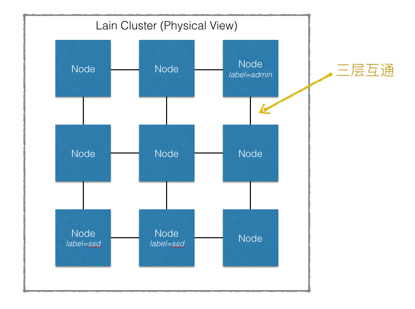
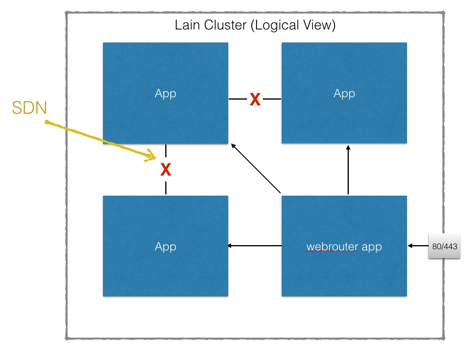
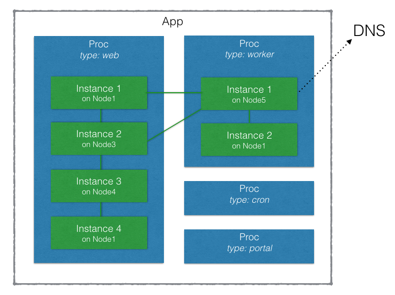
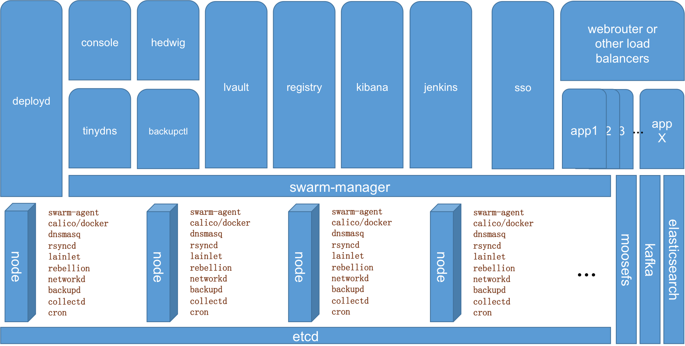

# Architecture

### 物理视图

从物理层面看，每一个 lain 集群是由一个或多个网络互通的节点（Node）构成的。

每个节点可以被赋予不同的 label ，供容器调度时进行节点选择使用。

目前的实现中，需要所有节点位于同一个路由器后。

### 逻辑视图

从逻辑层面看，一个 lain 集群是由多个应用组成，应用和应用之间网络相互隔离（通过SDN技术）。

每一个应用是由多个 Docker 容器组成，每个容器都可能运行在不同的节点上。

应用开发者可以在一个应用中定义多种容器（称为 proc），每个 proc 可以指定为在集群上运行多份，每份即为一个容器，被称为 proc instance 。Lain 集群会尽可能保证有指定份数的容器在运行，如果有容器 crash 或者节点 fail 的情况发生，集群会试图重启容器或者在节点间迁移容器。

## 系统架构设计图
>目标是做成一层一层可以深入的架构图

### 总图

### NODE

### 各子系统

- SDN
- [console](http://laingit.bdp.cc/panli7/console/blob/new_secret_files/README.md) URL ToBeUpdate
- [deploy](http://laingit.bdp.cc/yunfei/deployd/blob/freshmeat/README.md)
- [tinydns](http://laingit.bdp.cc/lain/tinydns/blob/master/README.md)
- [hedwig](http://laingit.bdp.cc/lain/hedwig/blob/docs/README.md)
- [backupctl](http://laingit.bdp.cc/yunfei/backupctl/blob/freshmeat/README.md) && [backupd](http://laingit.bdp.cc/yunfei/backupd/blob/freshmeat/README.md)
- [lvault](http://laingit.bdp.cc/chaoyiwang/lvault-v2/blob/master/docs/introduction.md) URL ToBeUpdate
- [sso](http://laingit.bdp.cc/lain/sso/blob/master/docs/introduction.md)
- [registry](http://laingit.bdp.cc/lain/registry/blob/master/README.md)
- [kibana && kafka , es](http://laingit.bdp.cc/zhuofuxu/libana/blob/master/docs/libana.md)
- [webrouter](http://laingit.bdp.cc/lain/webrouter/blob/master/README.md)
- [lainlet](http://laingit.bdp.cc/yunfei/lainlet/blob/freshmeat/README.md)
- [rebellion](http://laingit.bdp.cc/lain/rebellion/blob/master/README.md)
- [networkd](http://github.com/laincloud/networkd/blob/master/README.md)
- [jenkins](http://laingit.bdp.cc/lain/jenkins/blob/master/README.md)
