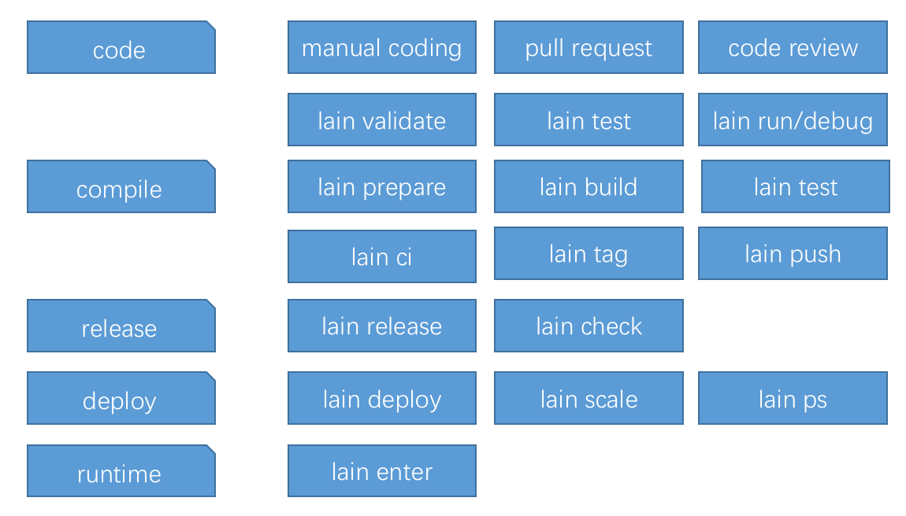
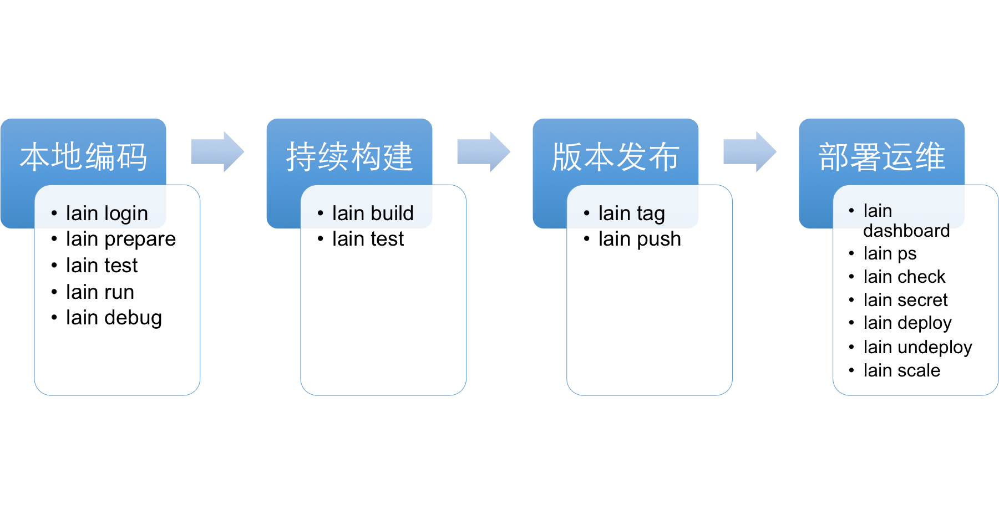

# Features

### 基于配置文件定义应用

- 在现有的应用上只需要增加一个配置文件 lain.yaml 即可定义应用在 lain 集群里的编译和运行
- 对应用代码的侵入性很低

### SDN 网络安全隔离

- 使用开源的 [calico](https://github.com/projectcalico/calico) 项目构建 [SDN 网络](https://zh.wikipedia.org/wiki/%E8%BB%9F%E9%AB%94%E5%AE%9A%E7%BE%A9%E7%B6%B2%E8%B7%AF)
- 高效率的应用内网络互通
- 应用间网络默认隔离
- 显式声明应用间的服务互访

### 基于容器技术支持多样化的技术栈

- 使用开源的 [docker](https://github.com/docker/docker) 项目构建容器云
- 扩展封装 Dockerfile ，使用自定义的 yaml 格式进行应用的集群定义
- 只要符合最简单的 lain cluster runtime interface ，可自由选择制作 base image
- 容器技术天然的支持隔离系统和应用的依赖
	- lain SDK/CLI 以及 可选的 ci 组件支援代码版本和镜像之间的对应关系
	- 编译时和运行时镜像均可完全定制和隔离

### 应用在线扩容缩容

- 使用开源的 [swarm](https://github.com/docker/swarm) 调度应用部署
- 深度封装 swarm docker API，自行开发集群控制器 （deployd）以及应用控制器（console）
	- 直接支持用户 API 调用进行容器实例数扩容，缩容
	- 直接支持用户 API 调用进行容器单实例资源的扩容，缩容（CPU，MEM）

### 节点在线扩容缩容

- 使用开源的 [ansible](https://github.com/ansible/ansible) 开发集群管理运维工具包
- 集群的服务器节点（NODE）兼容同一个 C 段内的 物理服务器，虚拟机，公有云服务器
- 集群管理工具包支持 add NODE 和 remove NODE 指令，快速进行底层资源扩容和缩容

### 服务自动维持和灾难恢复

- 自行开发集群控制器 （deployd）
	- 容器实例级别的服务巡检和维持，自动迁移和服务恢复
	- 基于虚 ip 自动漂移的入口 load balancer HA
	- 高级 API 支持服务定制迁移

### 内部服务依赖和发现机制

- 集群支援 Service / Resource 机制
	- 集群整体的 Service 服务应用
	- 应用私有 Service （即 Resource）服务应用
- 集群支援特别的 Service 应用类型和 Resource 应用类型
- 在 lain.yaml 中显式声明使用的 Service / Resource
	- 基于 DNS 的服务发现机制
	- 可编程的 service/resource load balancer
	- 默认提供可用的 RoundRobin 类型的  load balancer

### 统一认证

- 集群自行开发统一认证组件 （sso）
- 支持 oauth2 的多种认证方式

### 虚 ip 和 load balancer 统一管理

- 支援 virtual ip 和 应用 proc 的注册，应用可注册 virtual ip 来进行对外服务
- 基于 etcd lock 机制的 virtual ip 漂移机制，应用 load balancer 可借此实现 HA

### web load balancer 的自动配置

- 使用开源的 [nginx](https://github.com/nginx/nginx) 和 [tengine](https://github.com/alibaba/tengine) 封装 web 服务的 load balancer
- 自研的 watcher 检测集群应用的整体 runtime 数据，自动为 web 服务生成配置
	- 获取 runtime 变化的时间，判断是否需要进行配置变更
	- 配置变更事件出发配置的渲染
	- 触发 reload 生效

### 集群体系化的日志收集

- 使用开源的  [heka](https://github.com/mozilla-services/heka) 配合 docker 的配置以及 rsyslog 封装集群整体日志收集
- 默认收集应用的 stdout/stderr 日志收集
- 支援应用显式声明需要收集的落地文件日志
- 支援应用显式声明结构化的监控数据日志
- 定制检测 web 服务 load balancer 的 nginx 日志收集和数据统计

### 私有 docker registry 以及认证机制

- 使用开源的 [docker registry](https://github.com/docker/distribution) 封装私有 registry 应用
- 集成支援集群的私有统一认证机制
- 定制支援可选的 moosefs 存储后端或者 Ceph 存储后端

### 应用配置加密存储

- 使用开源的 [vault](https://github.com/hashicorp/vault) 封装的应用私有配置加密存储组件
- 集成 sso 组件实现用户管理和权限隔离
- 在应用运行时阶段将配置注入

### 本地化开发环境

- 使用开源的 [vagrant](https://github.com/mitchellh/vagrant) ，免费的 [centos](https://www.centos.org/) 和 [virtualbox](https://www.virtualbox.org/) 组织统一的本地化开发环境
- 甚至支援本地使用上述工具链 bootstrap 出一个  lain 本地集群

### 应用部署运维 API 以及相应的 CLI 客户端

- 应用的构建，发布，部署，运维 都由集群的各组件提供 API
- 使用 lain SDK/CLI 再次封装上述 API ，给用户提供良好的操作界面
- 集成集群的统一认证，进行用户管理和权限隔离

### 集群管理 CLI

- 使用开源的 [ansible](https://github.com/ansible/ansible) 开发集群管理运维工具包
- 再次封装 ansible 调用为简单的 [CLI](../adminmanual/lainctl.html) 使得操作更方便，包括增加节点，移除节点，迁移应用，集群健康检查等。

### 规范化的开发 workflow

- 基于上述组件，以 代码-镜像 的一一对应关系进行 SCM，对镜像进行发布管理
- 使用 lain SDK/CLI 以及可选的 ci 组件进行本地开发、构建发布，会很自然的规范开发 workflow

>工作流运转的核心单位是镜像，lain cli 封装了镜像的生成，更新，推送，部署，运维

### 可选的集群体系化的备份和恢复 ( backupd + moosefs )

- 采用开源的 [moosefs](https://github.com/moosefs/moosefs) 作为分布式存储后端
- 支援在 lain.yaml 中显式声明 volume 备份需求和策略，以及设定备份策略的 hooks
- 支援指定备份恢复

### 可选的集群日志查询组件 （ kafka + elasticsearch + kibana ）

- 采用开源的 [kakfa](https://github.com/apache/kafka)  , [elasticsearch](https://github.com/elastic/elasticsearch) , [kibana](https://github.com/elastic/kibana) 搭建外部依赖的 kafka 集群和 elasticsearch 集群，封装集群可选组件 libana
- rebellion 集群日志收集组件支援发送所有日志到上述外部依赖 kafka
- 在 libana 上支援对集群应用日志和 web load balancer 日志的条件组合查询

### 可选的系列预置应用

- [mysql-service](https://github.com/laincloud/mysql-service)
- [mysql-resource](https://github.com/laincloud/mysql-resouece)
- [redis-service-sm](https://github.com/laincloud/redis-service-sm)
- etc.
