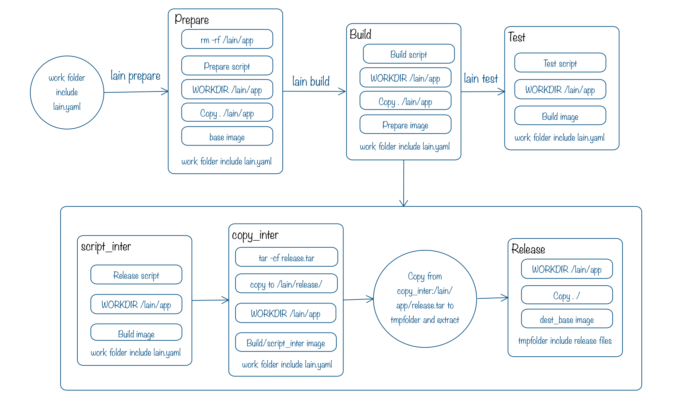

# lain.yaml

>本节介绍 lain.yaml 如何编写以及 lain-cli 在编译 lain.yaml 时的 image 产物

## 1. lain.yaml 可选内容

在 LAIN 中创建一个 app 时，最重要的就是在应用的根目录下定义好一个正确的 lain.yaml。一个完整的 lain.yaml 可以包含以下内容：

```
appname: {APP_NAME}             # 全局唯一的应用名

build:                          # 描述如何构建应用 build image 
  base: {BASE_IMAGE}            # 一个已存在的 docker image ，包含编译环境和默认的配置     
  prepare:                      # 描述如何构建应用 prepare image
    version: {PREPARE_VERSION}    # prepare 版本号，字符串类型
    script:                       # 定义构建 prepare image 时需要的 script
        - {PREPARE_SCRIPT}
  script:                         # 定义构建 build image 时需要的 script
    - {BUILD_SCRIPT}

release:                        # 描述如何构建应用 release image，可选
  dest_base: {DEST_BASE_IMAGE}  # release image 基于的 base image
  copy:                         # 定义将哪些内容 copy 到 release 镜像中
    - src: {SRC_FILE/SRC_FOLDER}
      dest: {DEST_FILE/DEST_FOLDER}

test:                           # 描述如何构建应用 test image
  script:                       # 定义构建 test image 时需要的 script
    - {TEST_SCRIPT}

proc.{PROC_NAME}:           # 定义一个 proc, 定义 web 时，可以只用 web 表示 web.web
  type: worker              # 默认为 worker，还包括 oneshot, web, portal
  image: {PROC_IMAGE}       # 默认为 app image，也可以进行自定义
  cmd: {PROC_CMD}           # 启动 proc 时定义的命令
  num_instances: 1          # 部署时 proc 的个数，默认为 1
  https_only: true          # 针对 web 类型，默认为false, 是否只允许 https 访问
  healthcheck: '/url'       # 针对 web 类型，提供该 url 给 tengine 进行健康检查
  portal:                   # 如果 app 作为 service，提供服务的 proc 需要定义 portal
    allow_clients: "**"     # portal 允许的 client，默认提供给所有
    cmd: ./proxy            # 启动 portal 时的命令
    port: 4321              # portal 端口
  env:                      # 定义 proc 运行时需要使用的环境变量
    - ENVA=a
    - ENVB=b
  logs:                     # 声明应用需要落地的日志文件，被强制位于 /lain/logs 目录之下
    - {LOG_FILENAME}        # 对应 /lain/logs/{LOG_FILENAME}
  volumes:                  # volume 文件，proc 被删时数据也不会移出，和 persistent_dirs 等效
    - /var/log
    - /etc/nginx/nginx.conf:
        backup:                 # 定义备份策略
          schedule: "0 23 * * *"# 依次为 分，时，日，月，周，同 crontab 
          expire: "10d"         # 过期时间,数字+单位, 如10d表示10天, 10h表示10小时, 3m表示3分钟
          pre_run: {PRE_HOOK}   # pre hook, 备份执行前调用
          post_run: {POST_HOOK} # post hook, 备份结束后调用
  mountpoint:                   # 目前只支持 ProcType==web && ProcName==web 的 proc
    - a.external.domain1/b/c    # 响应 a.external.domain1 这个外网域名 b/c 段 location 的请求，转发到 lain 内网 upstream
    - d.external.domain2/e      # 响应 d.external.domain2 这个外网域名 e 段 location 的请求，转发到 lain 内网 upstream
  secret_files:                 # 定义 secret file 作为配置文件
    - /secrets/hello            # 定义文件路径，为相对路径时前面会加上 `/lain/app/`
    - secret.dat 
  stateful: true                # 默认为 false, 表示 proc 挂掉时，并不会在另外一个节点重新启动容器
  setup_timeout: 0              # 单位为秒，proc 多 instance 升级时，设置升级前一个 proc 后隔多少秒升级后一个应用，用于保障服务不中断
  kill_timeout:  10             # 单位为秒，下线 proc 容器时强制删除的时间，即 docker stop timeout 时间\

use_services:       # 指出需要使用 service
  {SERVICE_NAME}:   # 标明 service app name
    - {PROC_NAME}   # 指出要使用的 service proc，这个 proc 已经定义了相应的 portal

use_resources:      # 指出需要使用 resource
  {RESOURCE_NAME}:  # 依赖的 resource app name
    memory: 32M     # 给一系列可自定义的参数赋值，也可以使用 resource 的默认值
    services:       # 定义一系列依赖的 resource proc, proc 已经定义了相应的 portal
      - {PROC_NAME}

```


## 2. lain.yaml 编译过程

用户在使用 lain-cli 命令时，lain.yaml 在各阶段的 image 的编译与转换过程如下图所示：




## 3. 注意事项
在编写对应的 lain.yaml 时，有一些点需要注意：

- 在编译 prepare image 时，如果 base, script 或者 keep 发生变化，请变更这个版本号，否则不用变动

- 各阶段的 script 语句均在 /lain/app/ 路径下执行，所以上一行的 `cd` 等操作不会对下面行的工作目录产生影响

- release 阶段可以不写，如果不写，lain-cli 会把 build 阶段生成的 image 打上 release 的标签

- relese 中的 copy 指定把 script 运行结束后的中间结果 image 的路径 src 拷贝到 dest_base 中的 dest 中, src 可以是绝对路径或者是相对于 /lain/app 的路径

- 在编写 proc 时，支持几种简写形式：在定义 web 类型的 proc 时，可以直接用 web 代替 proc.{PROC_NAME}；定义 service 时，可以简单的将 portal 定义在 proc 下面，也可以单独定义一个 proctype 为 portal 的 proc

- volumes 定义的文件默认位于 /data/lain/volume/{APP_NAME}/{APP_NAME}.{PROC_TYPE}.{PROC_NAME}/{INSTANCE_NO}/ 目录下

- 定义 volumes/persistent_dirs 与 stateful 选项都能使得 proc 在升级的时候不移动到其它节点，但是 statefule 定义为 true 时可以使得某个节点宕机后，集群不会在另外的节点拉起 proc，主要为了防止某些应用需要历史数据

- 由于 LAIN 中暂时不支持 proc 的别名定义机制，因此在定义 `use_services` 或 `use_resources` 时，使用的 services 和 resources 的 proc 不能存在相同的 procname，否则使用 lain-cli 进行 build 时会报错，部署后 portal 的访问也有可能出现问题。
